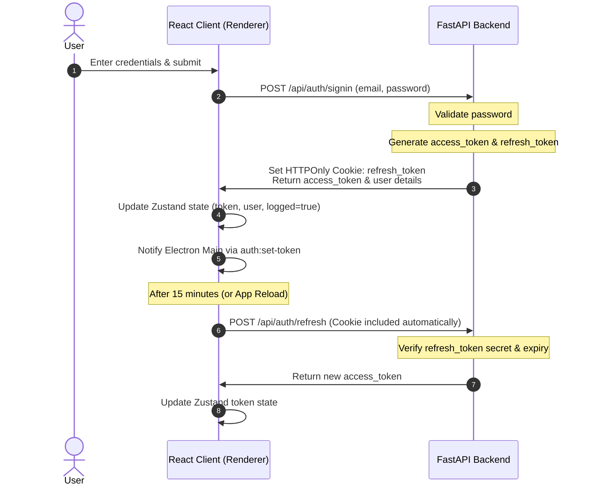
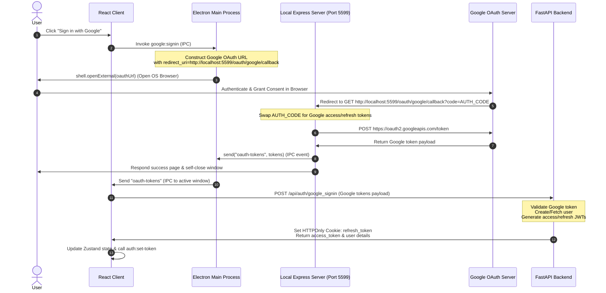

# Authentication & Token Management Architecture

This document describes the design and implementation of the authentication system in DOST, spanning the FastAPI backend, the Electron main process (including its local Express server), and the React renderer client.

---

## 1. Architectural Overview

DOST uses a secure token system combining:
1. **Short-lived Access Tokens:** JWTs sent in the `Authorization: Bearer <token>` header for API requests.
2. **Long-lived Refresh Tokens:** JWTs stored in an `HttpOnly`, secure cookie, used to request new access tokens.
3. **Bridge State Synchronization:** Electron's main process and React's renderer process are synchronized via IPC to isolate user profiles and manage active tool settings.

### Key Components
* **FastAPI Backend ([routers/auth.py](file:///d:/Python%20Save%20files/dost-mcp/mcp-server-web/routers/auth.py)):** Exposes endpoints for credentials login, Google authentication, token refresh, and logout.
* **React Client Store ([authStore.js](file:///d:/Python%20Save%20files/dost-mcp/mcp-desktop-client/client/src/store/authStore.js)):** A Zustand store managing the login state, Axios token headers, and scheduling periodic token refreshes.
* **Electron Preload Bridge ([preload.js](file:///d:/Python%20Save%20files/dost-mcp/mcp-desktop-client/electron/preload.js)):** Exposes APIs (`authAPI`, `googleAPI`, `oauthAPI`) safely to the frontend.
* **Electron Main Auth ([authIPC.js](file:///d:/Python%20Save%20files/dost-mcp/mcp-desktop-client/electron/authIPC.js)):** Manages user-specific file storage profiles and initializes tool environments on token changes.
* **Local Express Server ([server.js](file:///d:/Python%20Save%20files/dost-mcp/mcp-desktop-client/electron/server/server.js) / [routes.js](file:///d:/Python%20Save%20files/dost-mcp/mcp-desktop-client/electron/server/routes.js)):** Runs locally on port `5599` to catch Google OAuth callbacks.

---

## 2. Credentials Sign-In & Token Refresh Flow

The credentials flow manages registration, validation, cookie management, and periodic silent token refreshing.



### Cookie Configuration
The FastAPI server writes the refresh token as a cookie using secure defaults to allow cross-origin requests from the Electron app (`app://` origin):

```python
def set_auth_cookie(response: Response, token: str, request: Request):
    origin = request.headers.get("origin", "")
    is_electron = origin.startswith("app://")

    response.set_cookie(
        key="refresh_token",
        value=token,
        max_age=settings.refresh_token_expire_days * 24 * 60 * 60,
        httponly=True,
        secure=is_electron,                      # True for app:// to protect token transfer
        samesite="None" if is_electron else "Lax",# None for Electron compatibility, Lax for browser localhost
        path="/",
    )
```

### Client Refresh Loop
The React application triggers the refresh token loop immediately upon loading (if logged in) and Schedules a background refresh every 15 minutes:

```javascript
useEffect(() => {
	if (logged) {
		// Refresh immediately on load
		refreshToken();

		// Refresh every 15 minutes
		const interval = setInterval(() => {
			refreshToken();
		}, 15 * 60 * 1000);

		return () => clearInterval(interval);
	}
}, [refreshToken, logged]);
```

---

## 3. Google OAuth Sign-In Flow

Since Electron runs in an isolated native shell, logging in with Google requires opening an external browser window, intercepting the auth callback via a local loopback server, and returning the auth credentials back to the application.

### Detailed Architecture Flow



### Loopback OAuth Callback Receiver
The Electron main process starts an Express server on startup. The callback endpoint handles the token exchange:

```javascript
server.get("/oauth/google/callback", async (req, res) => {
	const code = req.query.code;
	if (!code) {
		return res.status(400).send("Missing authorization code");
	}

	try {
		const tokenResponse = await fetch("https://oauth2.googleapis.com/token", {
			method: "POST",
			headers: {
				"Content-Type": "application/x-www-form-urlencoded",
			},
			body: new URLSearchParams({
				client_id: config.GOOGLE_CLIENT_ID,
				client_secret: config.GOOGLE_CLIENT_SECRET,
				code,
				grant_type: "authorization_code",
				redirect_uri: "http://localhost:5599/oauth/google/callback",
			}),
		});
		const tokens = await tokenResponse.json();

		if (tokens.access_token && mainWindow) {
			// Send Google tokens to React renderer
			mainWindow.webContents.send("oauth-tokens", tokens);
			res.send(`
				<html>
					<head><title>Sign-In Success</title></head>
					<body>
						<h1>Google Sign-In successful!</h1>
						<p>This window will close automatically.</p>
						<script>setTimeout(() => window.close(), 1000);</script>
					</body>
				</html>
			`);
		} else {
			res.status(400).send("Token exchange failed");
		}
	} catch (error) {
		console.error("OAuth callback error:", error);
		res.status(500).send("Internal server error");
	}
});
```

---

## 4. Main Process IPC & Profile Isolation

Once React receives the access token (on login, refresh, or Google login), it updates its store and calls `window.authAPI.setToken(token)`.

This executes the main process IPC handler `auth:set-token` to establish context:

```javascript
ipcMain.handle("auth:set-token", async (event, token) => {
	const decodedUserId = decodeUserIdFromToken(token);
	if (!decodedUserId) {
		throw new Error("Invalid token payload: user id not found");
	}

	authToken = token;
	authUserId = decodedUserId;

	// Isolate local file databases and directories under this user ID
	setActiveUser(decodedUserId);
	
	// Persist logged status to Electron Store
	setPersistedLogged(true);
	
	// Configure active user ID for native tools (e.g. workspace folders)
	tools.setActiveUserId(decodedUserId);
	
	// Refresh/Load user keys and AI settings
	await aiModel.init();
	return true;
});
```

Similarly, on logout, `auth:clear-token` runs:
1. Clears global `authToken` and `authUserId`.
2. Resets tool states (`tools.resetForLogout()`).
3. Clears isolated user directories (`clearActiveUser()`).
4. Re-initializes AI models to a clean default state (`aiModel.init()`).
5. Persists `logged = false` to the local configuration store.
