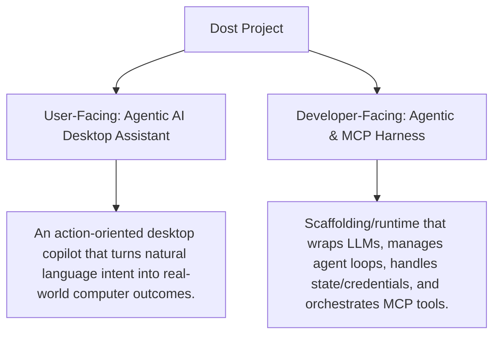
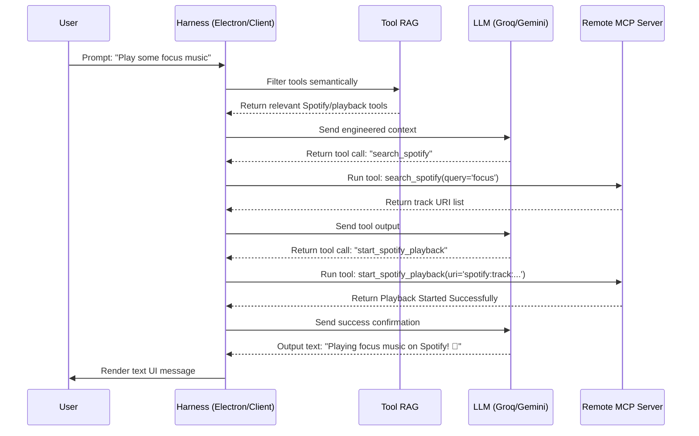

# Project Concept & Classification: Dost

This document provides a conceptual classification of **Dost** to define its role in the AI ecosystem, detailing how it serves as an **Agentic AI Desktop Assistant** for users and an **Agentic/MCP Harness** for developers, driven by **Context Engineering**.

---

## 1. Classification Overview

Dost occupies a dual role in the AI ecosystem depending on the target audience:



### User-Facing: **Agentic AI Desktop Assistant**
Unlike standard conversational chatbots (e.g., ChatGPT web interface) that only return text, Dost is built for **execution**. It uses an agentic reasoning loop that autonomously plans, executes, and chains multiple tool calls to modify desktop states, launch apps, and interact with cloud APIs.

### Developer-Facing: **Agentic & MCP Harness**
To a developer, Dost is a runtime harness. It is the scaffolding that houses raw LLMs and links them to the Model Context Protocol (MCP). The harness takes care of the complex engineering—handling loop limits, managing secure OAuth tokens, rendering UI components, and connecting to pluggable tool servers—freeing the LLM to focus on reasoning.

---

## 2. Context Engineering in Dost

**Context Engineering** is the active design, optimization, and assembly of the LLM prompt context window to maximize performance and minimize token usage. Dost implements three core context engineering patterns:

```
┌─────────────────────────────────────────────────────────────┐
│                      CONTEXT WINDOW                         │
│                                                             │
│  ┌───────────────────────────────────────────────────────┐  │
│  │ 1. DYNAMIC SYSTEM PROMPT                              │  │
│  │    Injects OS, Timezone, Locale, and Persona          │  │
│  │    "You are Dost - running on Windows (x64)..."       │  │
│  └───────────────────────────────────────────────────────┘  │
│  ┌───────────────────────────────────────────────────────┐  │
│  │ 2. CONVERSATION SUMMARY (Token Budgeting)             │  │
│  │    Slices older chats, summarizes, and prepends       │  │
│  └───────────────────────────────────────────────────────┘  │
│  ┌───────────────────────────────────────────────────────┐  │
│  │ 3. DYNAMIC TOOL SCHEMAS (Tool RAG)                    │  │
│  │    Injects only semantically relevant tool metadata   │  │
│  └───────────────────────────────────────────────────────┘  │
│  ┌───────────────────────────────────────────────────────┐  │
│  │ 4. USER QUERY & HISTORICAL WINDOW                     │  │
│  └───────────────────────────────────────────────────────┘  │
└─────────────────────────────────────────────────────────────┘
```

### A. Dynamic System Prompting
Dost constructs the system prompt dynamically on every message loop, injecting real-time environment data:
* Host Operating System & Architecture (e.g., `Windows (Build 10.0.22631) x64`)
* Host Timezone & Locale (e.g., `Asia/Kolkata`, `en-IN`)
* Default user configuration contexts.

### B. Tool RAG (Retrieval-Augmented Generation for Tools)
Feeding 50+ tool schemas into the context window causes token bloat, increases cost, and degrades model performance (leading to "tool confusion"). Dost solves this by performing semantic search on tools:
1. Embeds the user’s query.
2. Compares it against the indexed vector space of available tools.
3. Dynamically injects only the top matching tool schemas into the model’s context.

### C. Conversation Summarization (Token Budgeting)
To maintain long-running conversations without exceeding token context limits, Dost implements a moving context window:
* Keeps the last $N$ (configured by `SUMMARY_WINDOW_CONVERSATIONS`) turns completely intact.
* Slices turns older than the window, pipes them through a specialized summarization prompt, and replaces them with a single, highly dense system message: `[SUMMARY] Narrative...`.

---

## 3. The Agentic Harness (Runtime & Scaffolding)

The **Harness** is the infrastructure that brings the context-engineered prompts to life. It handles the practical operational loop:



* **The Execution Loop:** The harness runs `ToolLoopAgent`, handling step-by-step model calls, tool execution, output parsing, and feeding results back until the final message is ready.
* **Authentication and Security Scaffolding:** Manages OAuth 2.0 flows, securely caching credentials in a Valkey database, refreshing access tokens, and filtering sensitive client operations.
* **UI/UX Scaffolding:** Translates the raw text, tables, and Graphviz/DOT syntax generated by the model into a beautiful glassmorphic dashboard interface.
