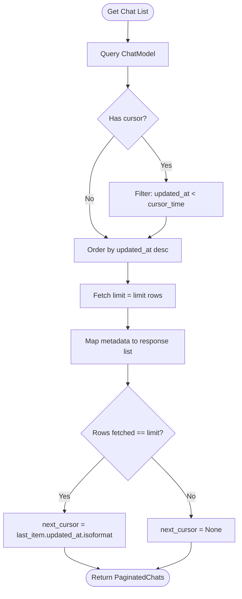
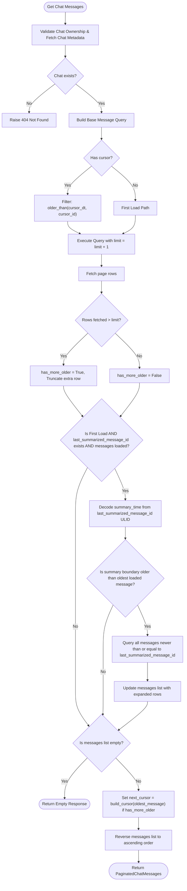

# Chat & Message Pagination Architecture

This document describes the cursor-based pagination architecture implemented in the DOST server and how it is integrated and consumed by the client applications.

---

## 1. Chat List Pagination

The chat list endpoint retrieves a user's active conversations, paginated with standard cursor-based scrolling.

### Backend Implementation

- **Endpoint:** `GET /api/chats/`
- **Controller/Router:** [routers/chat.py](file:///d:/Python%20Save%20files/dost-mcp/mcp-server-web/routers/chat.py#L12-L34) (`get_user_chats`)
- **CRUD Logic:** [crud/chat.py](file:///d:/Python%20Save%20files/dost-mcp/mcp-server-web/crud/chat.py#L11-L22) (`get_user_chats`)
- **Default Page Size:** 20 chats (configurable via `limit` query param, 1 to 100)

#### DB Query & Cursor logic:

1. **Ordering:** Sorted strictly by `updated_at` descending, placing the most recently updated chats at the top.
2. **Cursor format:** The ISO-8601 string of the last chat's `updated_at` timestamp.
3. **Paging Filter:** If a `cursor` is provided, the database filters out chats updated at or after the cursor, querying:
    ```sql
    ChatModel.updated_at < cursor_datetime
    ```
    This prevents page-drift duplicates when new chats are created while the user scrolls.



### Client-Side Integration

- **TanStack Query Key:** `["chats"]`
- **Query Setup:** `chatQueryOptions.list` inside the client queries config.
- **API call:** `getUserChats(limit, pageParam)`

The client fetches pages incrementally by retrieving `next_cursor` from the last page fetched, passing it as `pageParam` to the query function.

---

## 2. Chat Messages Pagination (with Summary Boundary Expansion)

Retrieving messages inside a specific chat is more complex because:

1. High-frequency messaging can lead to identical creation timestamps (`created_at`).
2. The UI requires chronological order (oldest messages at top, newest at bottom), but the DB query must fetch backwards (starting from the newest and going older).
3. The LLM context requires a contiguous block of messages since the last chat summarization. If a page cut-off splits these messages, context is lost.

### Backend Implementation

- **Endpoint:** `GET /api/chats/{chat_id}`
- **Controller/Router:** [routers/chat.py](file:///d:/Python%20Save%20files/dost-mcp/mcp-server-web/routers/chat.py#L37-L72) (`get_chat`)
- **CRUD Logic:** [crud/chat.py](file:///d:/Python%20Save%20files/dost-mcp/mcp-server-web/crud/chat.py#L67-L188) (`get_chat_messages_paginated`)
- **Default Page Size:** 30 messages (configurable via `limit` query param, 1 to 200)

#### Architectural Safeguards & Optimizations:

1. **Compound Ordering Key (`created_at`, `id`)**: To prevent overlap/skips when timestamps collide, the system enforces a strict compound sort comparison:
    - **Older Than Cursor:** `created_at < cursor_dt` OR (`created_at == cursor_dt` and `id < cursor_id`).
    - **Newer or Equal to Summary Boundary:** `created_at > boundary_dt` OR (`created_at == boundary_dt` and `id >= boundary_id`).
2. **Cursor Encoding**: The cursor is a base64-encoded string representing the compound tuple `(created_at, id)`.
3. **Optimized Existence Check**: The DB query fetches `limit + 1` rows. If `len(rows) > limit`, we know `has_more_older = True` without running a separate COUNT query.
4. **Summary Boundary Expansion (First-Load only)**:
    - When loading a chat for the first time (no cursor), if `last_summarized_message_id` is present, the server decodes the creation time directly from the ULID string in memory (using `_decode_ulid_time`). This avoids an extra DB read for the summary message.
    - If the summary boundary is older than the oldest message in the initial page payload, the server dynamically runs an expanded query to fetch **all** messages newer than or equal to the summary boundary.



#### Helper Functions in `crud/chat.py`:

```python
# Helper to check if a row is older than the cursor
def older_than(created_at: datetime, message_id: str):
    return or_(
        MessageModel.created_at < created_at,
        and_(
            MessageModel.created_at == created_at,
            MessageModel.id < message_id,
        ),
    )

# Helper to check if a row is newer than/equal to the summary boundary
def newer_or_equal(created_at: datetime, message_id: str):
    return or_(
        MessageModel.created_at > created_at,
        and_(
            MessageModel.created_at == created_at,
            MessageModel.id >= message_id,
        ),
    )
```

---

## 3. Client-Side Message Integration

The client application handles message retrieval using TanStack's `useInfiniteQuery`.

### Query Setup

- **Query Key:** `["chat", chatId, "messages"]`
- **API Call:** `getChat(chatId, { limit: 10, cursor: pageParam })`

### Chronological Assembly (`useMemo`)

Because each page of messages is returned chronologically (oldest first, newest last), and pages are retrieved in reverse-chronological order, the client compiles the full conversation list backwards from the oldest page to the newest:

```javascript
const mergedMessages = useMemo(() => {
	if (pages.length === 0) return [];

	const seenIds = new Set();
	const result = [];

	// Iterate from the oldest fetched page to the newest fetched page
	for (let i = pages.length - 1; i >= 0; i--) {
		const pageMessages = pages[i]?.messages || [];
		for (const message of pageMessages) {
			if (!seenIds.has(message.id)) {
				seenIds.add(message.id);
				result.push(message);
			}
		}
	}

	return result;
}, [pages]);
```

### Scrolling & Lazy-Loading Flow

1. **Initial Load:** Component mounts with `pageParam = null` (no cursor).
    - Backend returns the latest messages, automatically expanding the page if needed to cover the summary boundary.
    - If there are older messages beyond the retrieved window, the backend includes `next_cursor`.
2. **Scrolling Up:** When the user scrolls near the top of the chat window:
    - The list fires the pagination load handler.
    - Client calls `fetchNextPage()` using `next_cursor` as the next `pageParam`.
    - Newly retrieved older messages are prepended to the message list without disrupting the scroll position or resetting the active input.
