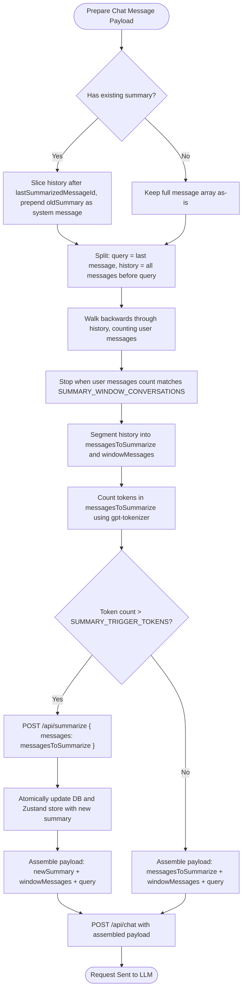

# Chat Summarization Architecture

This document describes the design and implementation of the rolling chat summarization system in DOST. This mechanism automatically compresses conversation history when it exceeds a token threshold, maintaining a clean, bounded LLM context window while retaining critical context.

---

## 1. Overview & Trigger Context

* **Frontend Location:** `client/src/components/ChatWindow.jsx` → `prepareSendMessagesRequest()`
* **Backend Endpoint:** `POST /api/summarize`
* **Zustand Store:** `client/src/store/chatStore.js`
* **Trigger:** The token count of `messagesToSummarize` exceeds the configured `SUMMARY_TRIGGER_TOKENS`.

---

## 2. Configuration Settings

These settings are controlled via client-side environment variables (`mcp-desktop-client/.env`):

| Variable | Default | Description |
| :--- | :--- | :--- |
| `VITE_SUMMARY_TRIGGER_TOKENS` | `1000` | Token limit for `messagesToSummarize` before triggering compression. |
| `VITE_SUMMARY_WINDOW_CONVERSATIONS` | `2` | Number of recent conversations (user-assistant pairs) to exclude from summarization. |

> [!NOTE]
> A **conversation** is defined as one user message paired with one assistant response.

---

## 3. Summarization Algorithm

### Step 1: Inject Existing Summary
If a previous summary exists for the chat:
1. Locate `lastSummarizedMessageId` in the full messages array.
2. Slice the array to keep only messages **after** that message ID.
3. Prepend the previous summary as a `system` message at index 0.

```
messages:      [U1][A1][U2][A2][U3][A3][U4][A4][U5][A5][U6query]
                         ↑
               lastSummarizedMessageId = A2

→ recentMessages = [oldSummary][U3][A3][U4][A4][U5][A5][U6query]
```
> The `oldSummary` is included in the new payload slice so that it gets recursively merged into the next summary, ensuring older context is never lost.

### Step 2: Split into Window + Summarize Segments
1. Isolate the current user query: `currentQuery = recentMessages[-1]`.
2. Extract the preceding history: `historyWithoutQuery = recentMessages[0..-2]`.
3. Walk **backwards** through `historyWithoutQuery` counting `user` messages.
4. Stop when the count reaches `SUMMARY_WINDOW_CONVERSATIONS` to find the `windowStartIndex`.

```
historyWithoutQuery:
[oldSummary][U3][A3][U4][A4][U5][A5]
                         ↑
               windowStartIndex (2nd user msg from end, with N=2)

messagesToSummarize = [oldSummary][U3][A3][U4][A4]   ← Sent for token checks & compression
windowMessages      = [U5][A5]                        ← Kept in raw form
```

### Step 3: Token Estimation
The client estimates tokens **only on `messagesToSummarize`** (not on the entire history or window).
* Uses `gpt-tokenizer/model/gpt-4o`.
* Converts messages from structured block parts into plain text prior to tokenizing.

### Step 4: Execution
* **If over token limit:**
  1. Send `POST /api/summarize` containing `messagesToSummarize`.
  2. Receives `newSummaryMessage`.
  3. Updates the database and Zustand store atomically with the new summary string and the new `lastSummarizedMessageId`.
  4. Returns the payload: `[newSummary][windowMessages][currentQuery]`.
* **If within token limit:**
  * Returns the payload as-is: `[oldSummary][historyWithoutQuery][currentQuery]`.

---

## 4. Architectural Data Flow



---

## 5. Storage & Store Integration

To prevent inconsistencies, the summary is updated atomically in memory and persisted on the backend:

| Storage Layer | Sync Function | Purpose |
| :--- | :--- | :--- |
| **Backend DB** | `updateChatSummary(chatId, text, lastId)` | Persists chat summaries and boundary IDs across app restarts. |
| **Zustand Store** | `setSummary(text, lastId)` | Reactively updates the client view and in-memory LLM request builder. |

---

## 6. Error Boundaries & Fallback

The client wraps the API request in a `try...finally` block. This guarantees that the UI loading spinner is cleared even if the summarization API fails:

```javascript
setSummarizing(true);
try {
  const result = await axios.post(`${API_URL}/api/summarize`, { messages: messagesToSummarize });
  // Process summary response ...
} catch (error) {
  console.error("Summarization failed:", error);
} finally {
  setSummarizing(false); // Spinner clears under all execution paths
}
```
