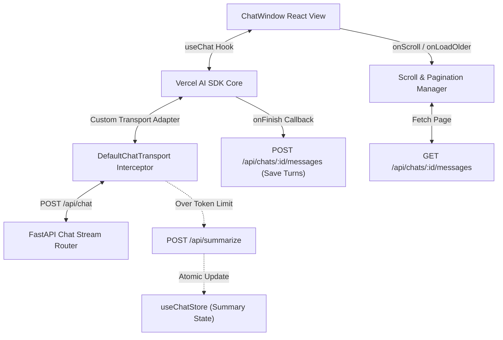
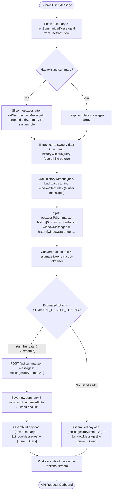
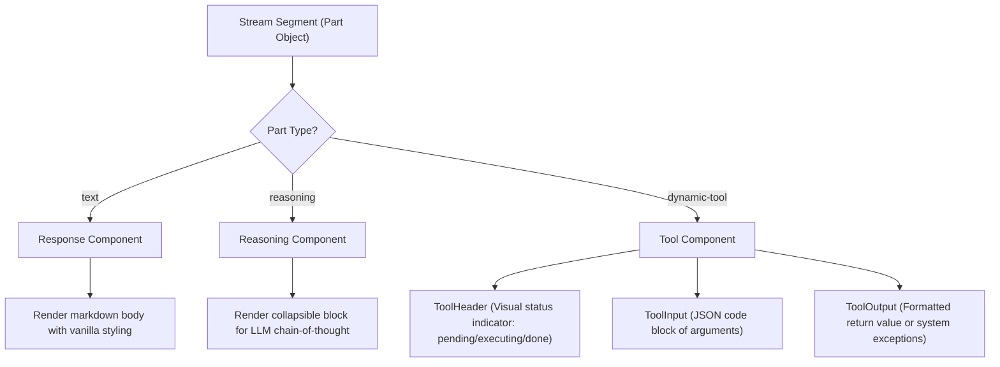
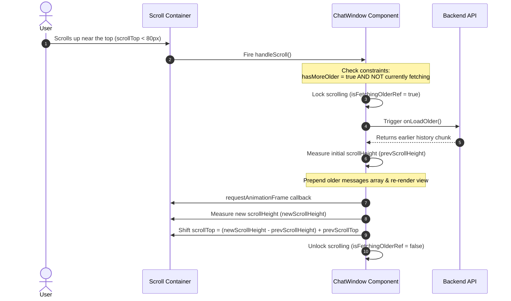
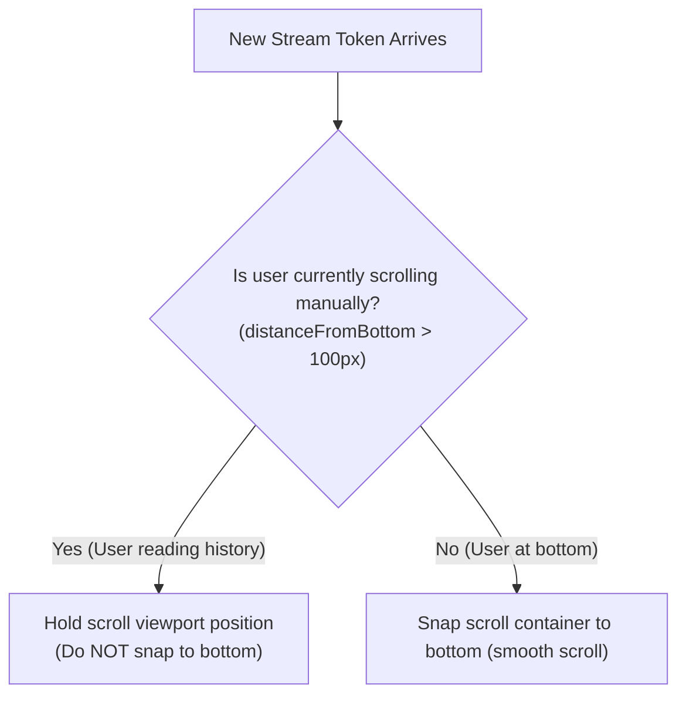

# Chat Window Component & Messaging Pipeline

This document provides an in-depth technical analysis of the core React chat interface implemented in [ChatWindow.jsx](file:///d:/Python%20Save%20files/dost-mcp/mcp-desktop-client/client/src/components/ChatWindow.jsx). It describes the custom rendering components, message serialization pipeline, token-based summarization interception, scroll management, and database synchronization workflows.

---

## 1. System Architecture

The chat interface coordinates several subsystems to achieve stream rendering, sliding-window message aggregation, and background database syncing:



---

## 2. Message Slicing & Windowing Pipeline

When a user submits a prompt, `prepareSendMessagesRequest` intercepts the history stack before it is sent to the LLM. It slices the array, estimates tokens, and triggers rolling summarization.

### Context Splitting Visual Map

Below is a conceptual layout mapping how $10$ messages are partitioned when `SUMMARY_WINDOW_CONVERSATIONS = 2` user-assistant turns:

```text
Accumulated Chat History:
[U1][A1] [U2][A2] [U3][A3] [U4][A4] [U5][A5] [U6 - User Prompt (Current Query)]
          ↑
          lastSummarizedMessageId = A2

Step 1: Slice History from lastSummarizedMessageId & Inject Old Summary
        [oldSummary] + [U3][A3][U4][A4][U5][A5]

Step 2: Isolate Current Query from Remaining History
        History without Query: [oldSummary][U3][A3][U4][A4][U5][A5]
        Current Query:         [U6]

Step 3: Walk Backwards to Split Sliding Window (Exclude N = 2 User Turns)
        [oldSummary][U3][A3][U4][A4] | [U5][A5]
        ----------------------------   -------
             To Summarize               Window

Step 4: Token Audit & Assembly
        Audit target: [oldSummary][U3][A3][U4][A4]
        
        IF OVER LIMIT:
            Assemble Payload: [newSummary] + [U5][A5] + [U6]
            
        IF WITHIN LIMIT:
            Assemble Payload: [oldSummary] + [U3][A3][U4][A4] + [U5][A5] + [U6]
```

### The Slicing Pipeline Flowchart



---

## 3. Custom Segment Renderers

Raw messages streams return complex layout types (reasoning chains, markdown blocks, and tool calls). These are mapped using the `MemoizedMessagePart` dispatcher:



---

## 4. Scroll Mechanics & Pagination Lifecycle

The conversation panel manages scrolling, auto-scroll locking during manual inspection, and infinite pagination.

### The Pagination & Scroll Sync Event Loop

To load past conversation pages without causing layout jumps or "scroll bouncing", the scroll manager performs height calculations inside a layout frame:



### Auto-Scroll Interlock Rules



---

## 5. State Synchronization & Cleanup

* **Message Persistence (`onFinish`):** When the Vercel AI SDK completes a streaming session, the client triggers `onFinish`. It takes the last user query and assistant response from the array and dispatches them to `updateChat(chatId, { messages: newTurns })` on the server database.
* **Store Integrity (`useChatStore`):** If a summarization event occurred, `setSummary(text, lastId)` synchronizes the in-memory context boundary.
* **Component Cleanup (`useEffect`):** Unmounting the chat window cancels debounced scroll timers and resets tracking flags (`isNearBottomRef`, `isFetchingOlderRef`) to prevent memory leaks and state updates on unmounted component trees.
