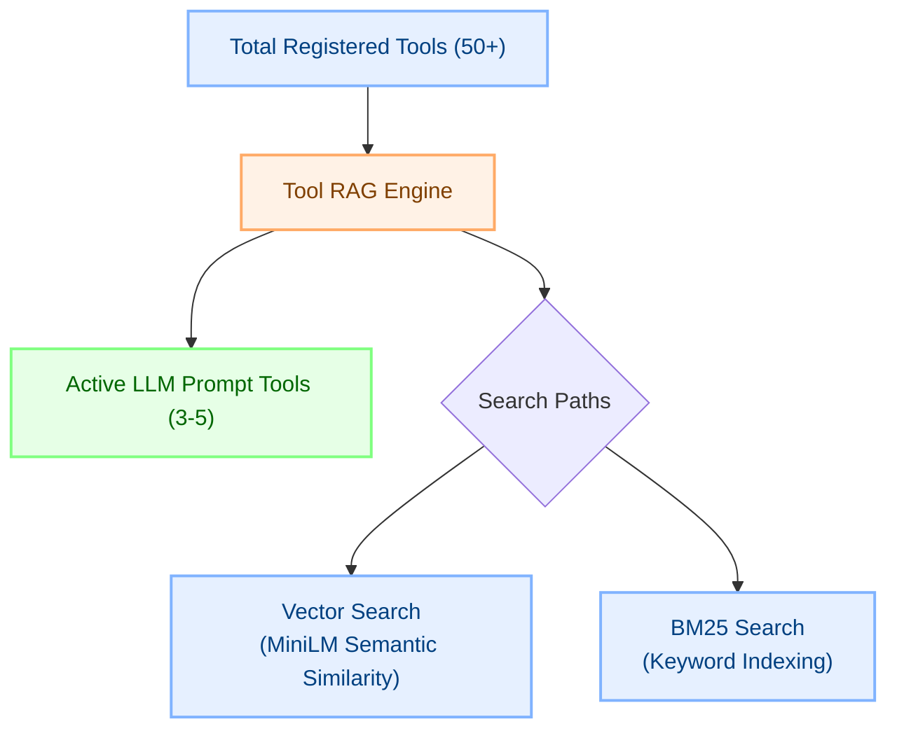
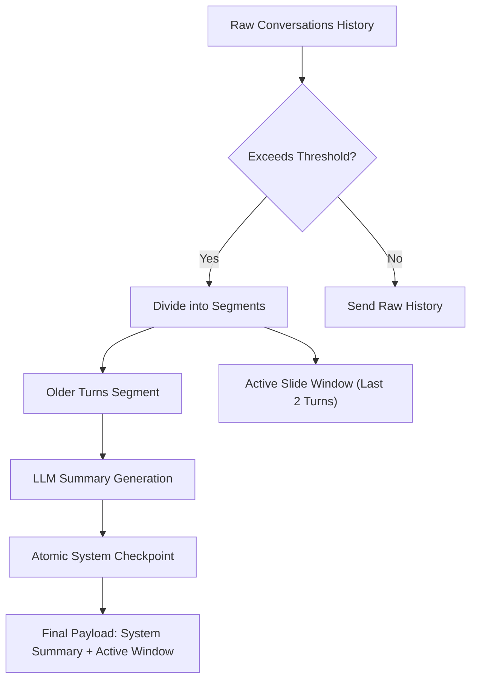
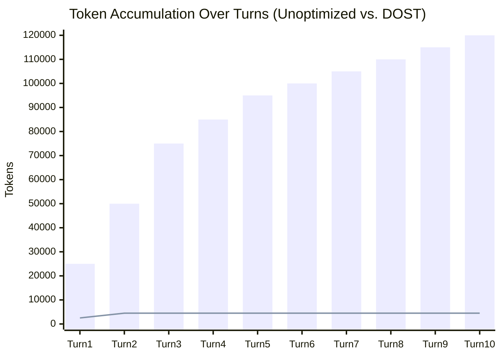

# Context Window and Token Optimization

In an agentic system like DOST, maintaining a low-latency execution loop and preventing context window exhaustion are primary engineering challenges. Agentic execution loops are inherently verbose: they require multi-step reasoning thoughts, detailed tool schemas, precise parameter inputs, and verbose execution results.

If left unchecked, this conversation volume quickly accumulates, leading to:
- **Exponential Token Costs:** API usage costs increase quadratically with conversational history.
- **Context Window Exhaustion:** Hard limits of the underlying LLM are reached, leading to abrupt crash states.
- **Attention Dilution:** Large prompt context windows degrade the model's ability to locate and strictly follow instructions (the "lost in the middle" phenomenon).

DOST solves these problems through a **dual-layer context optimization architecture** combining **Dynamic Tool Selection (Tool RAG)** and **Rolling Conversational Summarization**.

---

## 1. The Multi-Step Agent Bloat Problem

A typical single turn of an agent interacting with the local machine contains:
1. **User Message:** *"Find the error in the server logs and fix it."*
2. **System Tool Schemas:** 40+ tool definitions (often taking ~15,000 tokens).
3. **Agent Thought:** *"I need to read the log directory first."*
4. **Tool Call:** `list_dir({ path: "./logs" })`
5. **Tool Output:** Directory listing of 100+ files (~2,000 tokens).
6. **Agent Thought:** *"I will search for 'error' in server.log."*
7. **Tool Call:** `grep_search({ file: "./logs/server.log", query: "error" })`
8. **Tool Output:** 50 matching lines of error traces (~5,000 tokens).
9. **Final Output:** Explanation and proposed patch.

Without optimization, this single interaction consumes **over 25,000 tokens**. By the third turn of the conversation, the input history sent to the LLM exceeds **75,000 tokens**, causing latency to rise past 20 seconds and ballooning operational costs.

---

## 2. Layer 1: Dynamic Schema Filtering (Tool RAG)

Instead of sending all registered tool schemas to the model on every message, DOST implements a dynamic **Tool RAG** layer.

1. **Embedding and Indexing:** On startup, all tool names, descriptions, and parameters are embedded using a local `Xenova/all-MiniLM-L6-v2` model and stored in a local `@orama/orama` index.
2. **Query Retrieval:** Before sending a request to the LLM, the user query is evaluated. The system fetches the top **3-5** most relevant tools using combined vector similarity and BM25 search.
3. **Memory Continuity ("Sticky Context"):** To prevent tools from dropping out of the window during multi-turn debugging, tools used in the last **3 turns** are automatically kept active.

### Impact on Token Volume:
| Metric | Without Tool RAG | With Tool RAG | Reduction |
| :--- | :--- | :--- | :--- |
| **Active Tool Schemas** | 50+ | 3 - 5 | **90%** |
| **Tool Prompt Overhead** | ~18,000 tokens | ~1,200 tokens | **93.3%** |

---

## 3. Layer 2: Rolling Summarization

For long-running sessions, historical turns are systematically compressed via a **rolling summarization queue** triggered by token thresholds.

### The Compression Algorithm:
1. **Local Token Count:** When a user sends a message, the client checks the token count of the history using a local `gpt-tokenizer` instance.
2. **Slicing and Preserving:** If the token limit is crossed (default: `1,500` tokens), the system preserves the last **2 conversations** (user-assistant pairs) completely raw to maintain immediate conversational memory.
3. **Recursive Condensation:** The older history (along with any existing summary) is sent to a fast summarization model (`llama-3.1-8b-instant`). The resulting structured summary replaces the raw history on the database and is prepended to the message payload as a high-density `system` message.

---

## 4. Cumulative Performance Gains

By combining Tool RAG and Rolling Summarization, the context sent to the LLM remains strictly bounded, regardless of how long the conversation lasts.

### Comparative Session Benchmarks (10 turns):
- **Unoptimized Agent Loop:** ~120,000 tokens, average turn latency of 14.8 seconds, API cost: ~$1.20.
- **DOST Optimized Loop:** ~4,500 tokens, average turn latency of 1.9 seconds, API cost: ~$0.04.

This architecture enables developers to run complex, multi-tool agents locally on their machines for hours without experiencing context exhaustion or excessive API costs.
