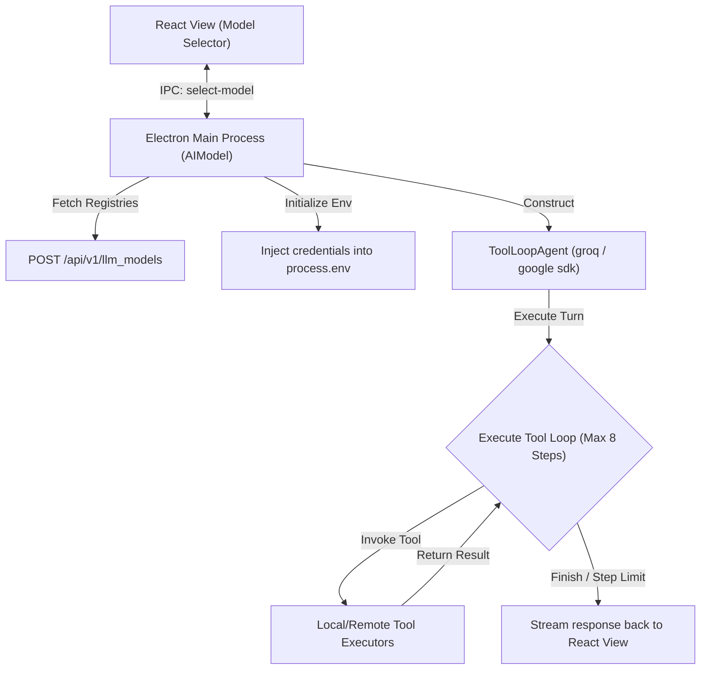
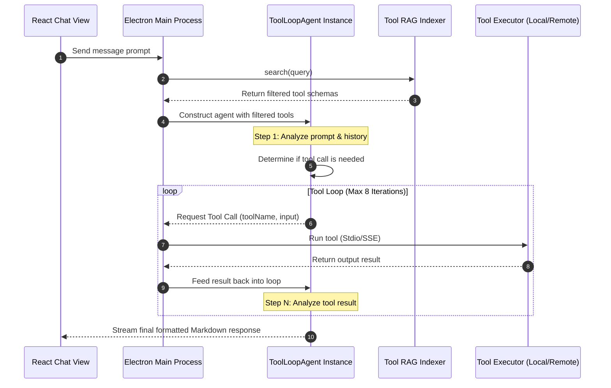

# LLM Provider Configuration & Agent Tool Loop

This document describes the design and implementation of the multi-model LLM provider configuration and the agentic tool execution loop in DOST.

---

## 1. System Overview

DOST provides a **Bring Your Own Keys (BYOK)** model layer, allowing users to configure API keys for multiple LLM providers (e.g. Groq, Google Gemini) and dynamically toggle models per-chat. The core controller for model selection and tool loop execution resides in the Electron main process:

* **Model Manager:** [models.js](file:///d:/Python%20Save%20files/dost-mcp/mcp-desktop-client/electron/models.js) (Class: `AIModel`)
* **IPC Controller:** [ipcHandlers.js](file:///d:/Python%20Save%20files/dost-mcp/mcp-desktop-client/electron/ai/ipcHandlers.js)
* **Agent Engine:** Vercel AI SDK Core (`ToolLoopAgent`)



---

## 2. Model Discovery & API Key Management

### A. Provider and Model Registry
On start, the model manager queries the central FastAPI database endpoint `/api/v1/llm_models` to fetch available providers, model lists, and configurations. It maps this data into the local reactive state (`state.providers`).

### B. Isolated Environment Credential Injection
To prevent key leaks, provider API keys are stored in the user-isolated configuration file (`users/{userId}/config.json`) inside the `aiConfig.envStore` object:

1. **Clear on Boot:** During initialization, `clearProviderEnvVars()` actively deletes any existing provider API keys from the application's current `process.env`.
2. **Context Injection:** When the active user loads the chat, the manager reads their encrypted credentials from `envStore` and injects them back into `process.env` dynamically:
   ```javascript
   process.env[provider.env_var] = envStore[providerName][provider.env_var];
   ```
3. **Multi-User Isolation:** When switching profiles, the environment variable map is wiped, and keys for the next user are loaded, preventing cross-account access.

---

## 3. The Agentic Tool Execution Loop

The core execution engine is powered by Vercel AI SDK's `ToolLoopAgent`. It analyzes user requests, selects appropriate tools, executes them in sequence, and generates final responses.

### Execution Cycle Sequence



### Safety & Guardrails
* **Step Limit Guardrail:** To prevent infinite cycles (e.g., two tools repeatedly triggering each other), the loop is constrained by a step limit of 8:
  ```javascript
  stopWhen: stepCountIs(8)
  ```
* **User Confirmation Interlock:** The agent is instructed via system prompts to draft changes and prompt the user for confirmation before performing any destructive or irreversible actions, such as shutting down/restarting the PC, deleting scheduled automation tasks, or sending emails.

---

## 4. Response Styling & Formatting Rules

The system prompt enforces strict formatting guidelines on the LLM to ensure visual consistency:

| Output Type | Formatting Rule | Example/Usage |
| :--- | :--- | :--- |
| **Structured Lists** | Markdown tables | System specifications, weather tables, contact lists, and stock history arrays. |
| **Math Formulae** | KaTeX notation | `$math$` for inline, `$$math$$` for blocks. |
| **Visual Flowcharts** | Graphviz / DOT | Rounded nodes, pastel themes, compact structures for relationships. |
| **OAuth Redirects** | Action hyperlinks | Rendered as `[Authorize here](url)` to trigger the client OAuth popups. |
