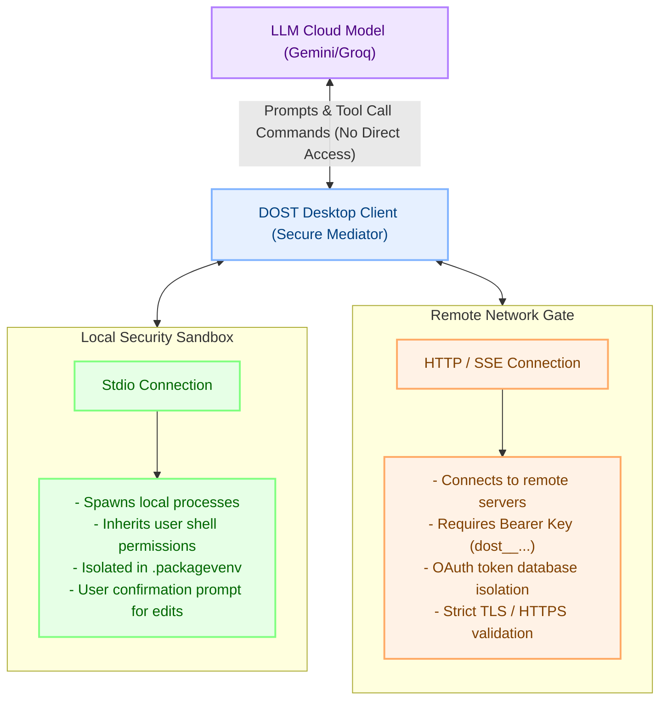

# Local vs Remote MCP Security

Model Context Protocol (MCP) allows LLMs to interact directly with local file systems, databases, and remote service APIs. However, granting external AI models execution privileges on a user's machine introduces significant security and privacy concerns.

DOST addresses these risks by establishing a strict execution boundary that segregates **Local Stdio execution** from **Remote SSE (Server-Sent Events) network calls**, ensuring user data remains isolated and secure.

---

## 1. The Security Boundary Model

In DOST, the LLM itself never executes code on the user's system. Instead, the desktop application client acts as a secure container and mediator between the LLM and the MCP servers.



- **Data Privacy Principle:** Sensitive local documents, database values, and environment structures are parsed locally by the desktop client. Only the final, filtered results of a tool execution (never raw file buffers or database dumps, unless requested) are sent back to the LLM.

---

## 2. Local Stdio Server Security

Local tools (e.g. filesystem access, terminal commands, process management) run via standard input/output (stdio) streams spawned directly by the desktop application.

### Sandbox & Execution Safeguards:
1. **Inherited Permissions:** Local stdio processes run under the user's system permissions. They cannot elevate privileges or execute commands outside of what the active user shell permits.
2. **Virtual Environment Isolation:** When spawning Python or Node.js stdio processes, the desktop client targets isolated virtual environments (`.packagevenv`). This ensures that scripts are executed in a controlled context with specific, locked dependency versions, protecting the host system from dependency pollution or malicious package injection.
3. **Explicit Consent & Feedback Loops:** For write-operations or command executions, the desktop client presents a confirmation UI, giving the user final veto power before any local script runs.

---

## 3. Remote SSE Server Security

Remote tools (e.g. fetching weather, checking stock prices, accessing Spotify, or pulling Google Calendar entries) communicate over HTTP/SSE.

```
[ Desktop Client ] ──(HTTPS + Bearer Key)──> [ Remote SSE Server ] ──> [ User Integrations ]
```

### Verification & Authentication Architecture:
1. **User Enrollment & Verification:** To access remote tools, users must enroll via the Next.js web portal. The system generates unique, cryptographically signed API keys (`dost__...`) linked to the user account.
2. **Access Control:** The remote server validates the client's API key via the backend database before executing any request. Unauthenticated or expired requests are immediately rejected with a `401 Unauthorized` status.
3. **OAuth Token Isolation:** Third-party OAuth tokens (such as Spotify or Google Workspace access tokens) are stored in the user's secure database schema. The desktop client never handles these credentials directly; the remote server uses them to perform actions, returning only the specific output requested by the tool.

---

## 4. Architectural Comparison

| Security Dimension | Local Stdio Servers | Remote SSE Servers |
| :--- | :--- | :--- |
| **Communication Protocol** | Process pipes (`stdin` / `stdout`) | Network connections (`HTTP` / `SSE`) |
| **Process Location** | Local machine (Host OS) | Remote cloud node |
| **Authentication Type** | OS User permissions | Bearer API Key (`dost__...`) |
| **Data Scope** | Local files, shell commands | Remote APIs, third-party integrations |
| **Credential Handling** | Local configuration files | Secure database storage |

By partitioning local execution from remote networking, DOST gives users the power of system-level automation without exposing their local environment to unverified remote access.
