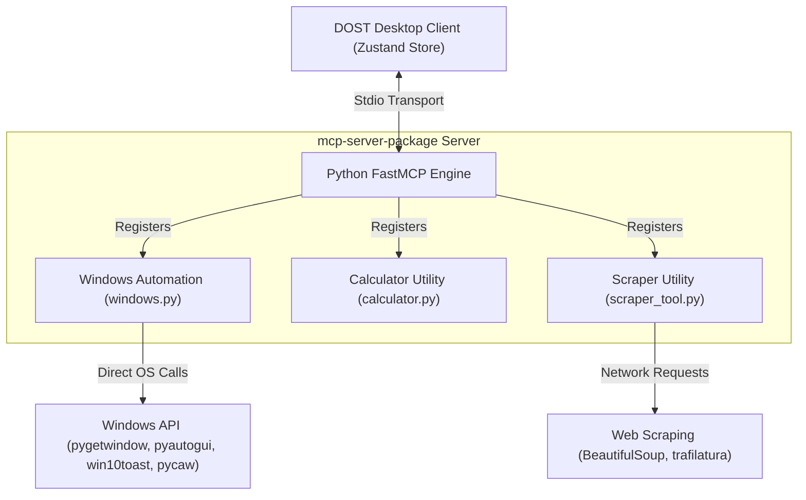

# Local Package MCP Server (mcp-server-package)

This document provides a technical description of the local Model Context Protocol (MCP) server (`mcp-server-package`) in the DOST application. It outlines the server's architectural design, its comprehensive local security model, and lists all registered local automation tools.

---

## 1. Overview & Architecture

The `mcp-server-package` is a local execution engine launched directly as a subprocess of the DOST client. It communicates with the host application using **Stdio streams** (standard input and output) and is implemented in Python using the **FastMCP** framework. 

It handles local utilities that require direct access to the host operating system, including system controls, window management, desktop interaction, file searches, scraping, and calculation utilities.

---

## 2. Local Safety & Security Model

Since the local server executes operations directly on the user's operating system, it enforces a strict multi-layered security model ([security.py](file:///d:/Python%20Save%20files/dost-mcp/mcp-server-package/tools/modules/security.py)):

### A. Input Sanitization & Traversal Prevention
* **Dangerous Character Filter:** Rejects strings containing command injection operators matching the pattern `[;&|`$()]`.
* **Path Traversal Shield:** Normalizes paths using `Path.resolve()` and explicitly rejects paths containing directory traversal patterns like `..` or leading escape sequences.

### B. Windows Device Filename Protection
* Prevents the creation of files with reserved Windows OS device names. Files matching names like `CON`, `PRN`, `AUX`, `NUL`, `COM1-9`, or `LPT1-9` are blocked to prevent operating system freezes.

### C. Directory Whitelisting
* Limits all file system reads and writes to a set of predefined directories. By default, these include:
  * `%USERPROFILE%\Documents`
  * `%USERPROFILE%\Pictures`
  * `%USERPROFILE%\Desktop`
  * `%USERPROFILE%\Downloads`
  * `%USERPROFILE%\Documents\MCP_Notes`
  * The current working directory of the application process.

### D. Application and Command Whitelisting
* Direct command executions are restricted to a safe whitelist:
  * Allowed system commands: `shutdown`, `schtasks`, `tasklist`, `taskkill`, `dir`, `type`.
  * Allowed graphical applications: Chrome, Firefox, Edge, VS Code, Spotify, Discord, Steam, Microsoft Word/Excel/PowerPoint, Paint, Calculator, and Notepad.

### E. Rate Limiting Decorators
* Critical system commands are rate-limited via a custom `@_rate_limit` decorator:
  * System power actions (shutdown, restart): Maximum 5 calls per 300 seconds.
  * Desktop notifications: Maximum 5 calls per 60 seconds.
  * Audio volume adjustments: Maximum 30 calls per 60 seconds.

---

## 3. Configuration System

Configurations are saved locally per-profile in a JSON settings file ([settings.json](file:///d:/Python%20Save%20files/dost-mcp/mcp-server-package/tools/settings.json)) managed by [config.py](file:///d:/Python%20Save%20files/dost-mcp/mcp-server-package/tools/config.py).

* **Screenshots:** Customize default output directory, filename patterns (timestamped), and formats (`png`, `jpg`).
* **Application Mappings:** Custom alias maps (e.g. linking `"chrome"` to `"chrome.exe"`) that the path resolver uses to locate the binaries on the host system.
* **Volume/Brightness Steps:** Default increments (e.g., 10%) for system level controls.
* **Search Engines:** Quick-query mappings for DuckDuckGo, Google, Bing, and YouTube.

---

## 4. MCP Tools Reference

Below is the complete inventory of all MCP tools registered on the server.

### A. General Time Tool

#### [get_time](file:///d:/Python%20Save%20files/dost-mcp/mcp-server-package/server.py#L17-L43)
* **Description:** Retrieves the current local time for a specific location, city, or timezone.
* **Signature:** `get_time(location: str = "") -> str`
* **Arguments:**
  * `location` (string, optional): A city name, country, or timezone string (e.g., `"Tokyo"`, `"Europe/London"`, `"Japan"`). If left empty, returns the server's current system local time.

---

### B. Windows Automation & Desktop Tools

These tools are imported from the [windows.py](file:///d:/Python%20Save%20files/dost-mcp/mcp-server-package/tools/windows.py) module and interface with the Windows OS.

#### [list_open_windows](file:///d:/Python%20Save%20files/dost-mcp/mcp-server-package/tools/windows.py#L98-L111)
* **Description:** Lists the window titles of all currently visible application windows running on the user's desktop.
* **Signature:** `list_open_windows() -> str`
* **Arguments:** None.

#### [focus_window](file:///d:/Python%20Save%20files/dost-mcp/mcp-server-package/tools/windows.py#L116-L130)
* **Description:** Brings an open application window to the foreground and focuses it using its title.
* **Signature:** `focus_window(title: str) -> str`
* **Arguments:**
  * `title` (string, required): Partial or exact name of the window title (e.g., `"Spotify"`, `"Chrome"`).

#### [minimize_window](file:///d:/Python%20Save%20files/dost-mcp/mcp-server-package/tools/windows.py#L135-L149)
* **Description:** Minimizes a target window to the taskbar.
* **Signature:** `minimize_window(title: str) -> str`
* **Arguments:**
  * `title` (string, required): Partial or exact name of the window title.

#### [maximize_window](file:///d:/Python%20Save%20files/dost-mcp/mcp-server-package/tools/windows.py#L154-L168)
* **Description:** Maximizes a target window to fill the screen.
* **Signature:** `maximize_window(title: str) -> str`
* **Arguments:**
  * `title` (string, required): Partial or exact name of the window title.

#### [close_window](file:///d:/Python%20Save%20files/dost-mcp/mcp-server-package/tools/windows.py#L173-L187)
* **Description:** Closes a specific application window.
* **Signature:** `close_window(title: str) -> str`
* **Arguments:**
  * `title` (string, required): Partial or exact name of the window title.

#### [schedule_task](file:///d:/Python%20Save%20files/dost-mcp/mcp-server-package/tools/windows.py#L193-L249)
* **Description:** Creates an automated background task in Windows Task Scheduler.
* **Signature:** `schedule_task(task_name: str, command: str, time_str: str, date_str: str = "") -> str`
* **Arguments:**
  * `task_name` (string, required): Name of the scheduled task.
  * `command` (string, required): Command or path to the script to execute.
  * `time_str` (string, required): Execution time in 24-hour format (`"HH:MM"`).
  * `date_str` (string, optional): Specific execution date in `"DD/MM/YYYY"` format. If omitted, schedules a daily recurring task.

#### [list_scheduled_tasks](file:///d:/Python%20Save%20files/dost-mcp/mcp-server-package/tools/windows.py#L254-L295)
* **Description:** Lists technical background jobs and automation scripts scheduled in the Windows Task Scheduler.
* **Signature:** `list_scheduled_tasks(filter_name: str = "") -> str`
* **Arguments:**
  * `filter_name` (string, optional): Keyphrase to filter task names.

#### [delete_scheduled_task](file:///d:/Python%20Save%20files/dost-mcp/mcp-server-package/tools/windows.py#L300-L327)
* **Description:** Permanently deletes a scheduled task from the Windows Task Scheduler.
* **Signature:** `delete_scheduled_task(task_name: str) -> str`
* **Arguments:**
  * `task_name` (string, required): Name of the task to delete.

#### [set_reminder](file:///d:/Python%20Save%20files/dost-mcp/mcp-server-package/tools/windows.py#L331-L382)
* **Description:** Registers a timer that displays a desktop notification when the duration expires.
* **Signature:** `set_reminder(time_string: str, message: str) -> str`
* **Arguments:**
  * `time_string` (string, required): Delay format (e.g. `"30s"`, `"15m"`, `"2h"`). Max delay is 24 hours.
  * `message` (string, required): Notification message content.

#### [get_system_info](file:///d:/Python%20Save%20files/dost-mcp/mcp-server-package/tools/windows.py#L388-L451)
* **Description:** Gathers software and hardware specifications, including operating system name and version, CPU model, CPU cores, active memory usage (RAM), and disk drive capacities.
* **Signature:** `get_system_info() -> str`
* **Arguments:** None.

#### [open_app](file:///d:/Python%20Save%20files/dost-mcp/mcp-server-package/tools/modules/application_manager.py#L202-L208)
* **Description:** Opens a Windows application using the smart resolver.
* **Signature:** `open_app(app_name: str) -> str`
* **Arguments:**
  * `app_name` (string, required): The application alias or name (e.g. `"notepad"`, `"chrome"`, `"spotify"`).

#### [open_webpage](file:///d:/Python%20Save%20files/dost-mcp/mcp-server-package/tools/modules/application_manager.py#L210-L215)
* **Description:** Opens a URL in the system's default web browser.
* **Signature:** `open_webpage(url: str) -> str`
* **Arguments:**
  * `url` (string, required): The web address to load (e.g., `"google.com"`, `"github.com"`).

#### [play_song](file:///d:/Python%20Save%20files/dost-mcp/mcp-server-package/tools/modules/application_manager.py#L217-L221)
* **Description:** Opens the default browser and plays a song search query on YouTube.
* **Signature:** `play_song(song: str) -> str`
* **Arguments:**
  * `song` (string, required): Song title or artist query.

#### [volume_control](file:///d:/Python%20Save%20files/dost-mcp/mcp-server-package/tools/modules/system_control.py#L235-L239)
* **Description:** Modifies system master audio volume.
* **Signature:** `volume_control(action: Literal["SET", "INCREASE", "DECREASE"], value: int = 0) -> str`
* **Arguments:**
  * `action` (string, required): Operation type: `"SET"`, `"INCREASE"`, or `"DECREASE"`.
  * `value` (integer, optional): The level target (0-100) or step amount.

#### [brightness_control](file:///d:/Python%20Save%20files/dost-mcp/mcp-server-package/tools/modules/system_control.py#L242-L246)
* **Description:** Modifies target screen brightness percentage.
* **Signature:** `brightness_control(action: Literal["SET", "INCREASE", "DECREASE"], value: int = 0) -> str`
* **Arguments:**
  * `action` (string, required): Operation type: `"SET"`, `"INCREASE"`, or `"DECREASE"`.
  * `value` (integer, optional): The brightness target (0-100) or step amount.

#### [system_power](file:///d:/Python%20Save%20files/dost-mcp/mcp-server-package/tools/modules/system_control.py#L249-L253)
* **Description:** Controls Windows system power state commands.
* **Signature:** `system_power(action: Literal["shutdown", "restart", "hibernate", "lock"]) -> str`
* **Arguments:**
  * `action` (string, required): Selected action: `"shutdown"`, `"restart"`, `"hibernate"`, or `"lock"`.

#### [create_note](file:///d:/Python%20Save%20files/dost-mcp/mcp-server-package/tools/modules/file_operations.py#L268-L274)
* **Description:** Writes new text files safely to the user's isolated note directory (`%USERPROFILE%\Documents\MCP_Notes`).
* **Signature:** `create_note(content: str, custom_filename: Optional[str] = "") -> str`
* **Arguments:**
  * `content` (string, required): The body of the note. Max size is 50KB.
  * `custom_filename` (string, optional): Filename prefix (e.g. `"todo"`). Defaults to timestamped file if empty.

#### [find_files](file:///d:/Python%20Save%20files/dost-mcp/mcp-server-package/tools/modules/file_operations.py#L277-L281)
* **Description:** Recursively searches for files or folders matching a query within an allowed start directory.
* **Signature:** `find_files(query: str, start_directory: str) -> str`
* **Arguments:**
  * `query` (string, required): The keyword to find in file/folder names.
  * `start_directory` (string, required): Absolute folder path to begin recursive search. Must be within whitelisted directories.

#### [screenshot](file:///d:/Python%20Save%20files/dost-mcp/mcp-server-package/tools/modules/desktop_interaction.py#L218-L222)
* **Description:** Captures the current visible state of the primary display screen and writes it to a file.
* **Signature:** `screenshot() -> str`
* **Arguments:** None.

#### [clipboard_manager](file:///d:/Python%20Save%20files/dost-mcp/mcp-server-package/tools/modules/desktop_interaction.py#L225-L229)
* **Description:** Reads (GET) or updates (SET) system clipboard contents.
* **Signature:** `clipboard_manager(action: Literal["GET", "SET"], text_to_set: Optional[str] = "") -> str`
* **Arguments:**
  * `action` (string, required): Selected action: `"GET"` or `"SET"`.
  * `text_to_set` (string, optional): The string to write. Max length is 10KB.

#### [show_notification](file:///d:/Python%20Save%20files/dost-mcp/mcp-server-package/tools/modules/desktop_interaction.py#L232-L236)
* **Description:** Displays a native Windows toast notification popup on the host.
* **Signature:** `show_notification(title: str, message: str, duration_seconds: int = 5) -> str`
* **Arguments:**
  * `title` (string, required): Bold title of the banner. Max length is 100 characters.
  * `message` (string, required): Primary notification message. Max length is 500 characters.
  * `duration_seconds` (integer, optional): Screen visibility duration (1 to 30 seconds). Defaults to `5`.

---

### C. Math & Calculation Tools

These tools are defined in [calculator.py](file:///d:/Python%20Save%20files/dost-mcp/mcp-server-package/tools/calculator.py). They run locally in a secure Python interpreter context.

#### [basic_math](file:///d:/Python%20Save%20files/dost-mcp/mcp-server-package/tools/calculator.py#L196-L237)
* **Description:** Evaluates basic list-based arithmetic operators.
* **Signature:** `basic_math(numbers: list[float], operation: str) -> Dict[str, Any]`
* **Arguments:**
  * `numbers` (list of floats, required): Input numbers.
  * `operation` (string, required): Supported options: `"sum"`, `"product"`, `"min"`, `"max"`, `"power"`, `"factorial"`, `"modulo"`, `"percentage"`.

#### [evaluate_expression](file:///d:/Python%20Save%20files/dost-mcp/mcp-server-package/tools/calculator.py#L240-L256)
* **Description:** Parses and evaluates complex mathematical expression strings using a secure Abstract Syntax Tree (AST) evaluator.
* **Signature:** `evaluate_expression(expression: str) -> Dict[str, Any]`
* **Arguments:**
  * `expression` (string, required): Mathematical expression string (e.g. `"(2+3)*4"`, `"sqrt(144)"`, `"sin(pi/2)"`).

#### [statistics_calc](file:///d:/Python%20Save%20files/dost-mcp/mcp-server-package/tools/calculator.py#L259-L290)
* **Description:** Computes statistical values from lists of numerical values.
* **Signature:** `statistics_calc(numbers: list[float], operation: str) -> Dict[str, Any]`
* **Arguments:**
  * `numbers` (list of floats, required): Input numbers.
  * `operation` (string, required): Selected metric: `"mean"`, `"median"`, `"mode"`, `"stdev"`, `"variance"`, or `"range"`.

#### [unit_converter](file:///d:/Python%20Save%20files/dost-mcp/mcp-server-package/tools/calculator.py#L293-L332)
* **Description:** Performs linear conversions between standard units. Auto-detects physical properties category.
* **Supported Categories:** Length, Weight, Area, Volume, Speed, Data, Time, and Temperature.
* **Signature:** `unit_converter(value: float, from_unit: str, to_unit: str) -> Dict[str, Any]`
* **Arguments:**
  * `value` (float, required): Input value size.
  * `from_unit` (string, required): Code of source unit (e.g. `"km"`, `"lb"`, `"celsius"`).
  * `to_unit` (string, required): Code of target unit (e.g. `"miles"`, `"kg"`, `"fahrenheit"`).

#### [date_calculator](file:///d:/Python%20Save%20files/dost-mcp/mcp-server-package/tools/calculator.py#L335-L395)
* **Description:** Performs calendar math calculations using `YYYY-MM-DD` ISO formatting.
* **Signature:** `date_calculator(operation: str, date1: str = "", date2: str = "", days: int = 0) -> Dict[str, Any]`
* **Arguments:**
  * `operation` (string, required): Operation: `"today"`, `"days_between"`, `"add_days"`, or `"day_of_week"`.
  * `date1` (string, optional): ISO date string.
  * `date2` (string, optional): ISO date string.
  * `days` (integer, optional): Number of days to add.

#### [base_converter](file:///d:/Python%20Save%20files/dost-mcp/mcp-server-package/tools/calculator.py#L397-L441)
* **Description:** Converts input numbers from a source numeral base to a target base.
* **Signature:** `base_converter(number: str, from_base: str, to_base: str) -> Dict[str, Any]`
* **Arguments:**
  * `number` (string, required): Input string (e.g. `"255"`, `"FF"`, `"11111111"`).
  * `from_base` (string, required): Source base type (`"dec"`, `"bin"`, `"oct"`, `"hex"`).
  * `to_base` (string, required): Target base type (`"dec"`, `"bin"`, `"oct"`, `"hex"`).

---

### D. Scraper & Web Search Tools

These tools are defined in [scraper_tool.py](file:///d:/Python%20Save%20files/dost-mcp/mcp-server-package/tools/scraper_tool.py).

#### [search_web](file:///d:/Python%20Save%20files/dost-mcp/mcp-server-package/tools/scraper_tool.py#L8-L83)
* **Description:** Executes search queries on DuckDuckGo and fetches the top results, returning titles, links, snippets, and truncated webpage contents.
* **Signature:** `search_web(query: str, num_results: int = 3, max_chars_per_page: int = 1000) -> str`
* **Arguments:**
  * `query` (string, required): Search terms.
  * `num_results` (integer, optional): Number of search result links to scrape. Defaults to `3`.
  * `max_chars_per_page` (integer, optional): Truncation limit for each page's text contents. Defaults to `1000`.

#### [scrape_webpage](file:///d:/Python%20Save%20files/dost-mcp/mcp-server-package/tools/scraper_tool.py#L86-L121)
* **Description:** Downloads and extracts clean text (formatted in Markdown) from any public webpage URL using Trafilatura or BeautifulSoup.
* **Signature:** `scrape_webpage(url: str) -> str`
* **Arguments:**
  * `url` (string, required): Target webpage URL.
