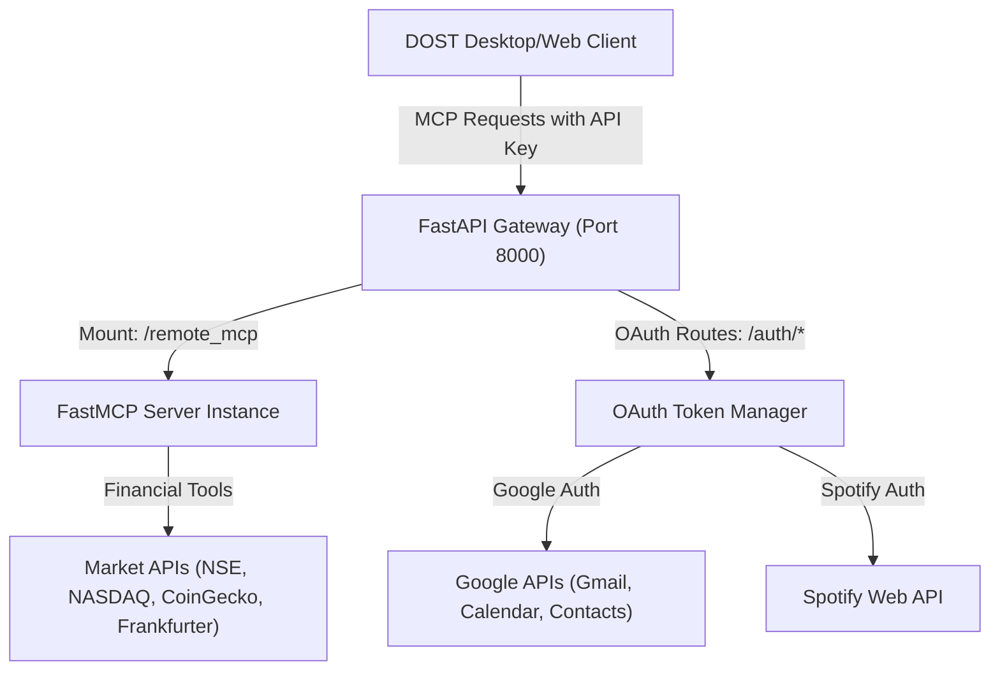

# Remote MCP Server (mcp-server-remote)

This document provides a technical overview of the remote Model Context Protocol (MCP) server (`mcp-server-remote`) used in the DOST ecosystem. It details the server's architecture, authentication flow, REST API endpoints, and a complete catalog of all registered tools.

---

## 1. Overview & Architecture

The `mcp-server-remote` acts as a proxy bridge between the DOST client applications and third-party APIs (such as Google APIs, Spotify, and stock/crypto market data). It is designed as a hybrid application combining a **FastAPI** web server with a **FastMCP** server interface.

### Key Capabilities
* **Security & Authentication:** Restricts tool access using customized API Key middleware ([api_key_auth.py](file:///d:/Python%20Save%20files/dost-mcp/mcp-server-remote/auth/api_key_auth.py)).
* **OAuth 2.0 Flow Management:** Provides built-in redirect and callback handlers for Google (Gmail, Calendar, Contacts) and Spotify services, storing tokens securely per-user.
* **Smart Financial and Market Analytics:** Fuzzy search resolution for stock symbols, cryptocurrencies, and currency names.
* **HTTP/SSE Transport:** Exposed via a streamable HTTP mount under `/remote_mcp`.

---

## 2. API & OAuth Endpoints

The FastAPI app ([server.py](file:///d:/Python%20Save%20files/dost-mcp/mcp-server-remote/server.py)) handles both Google and Spotify OAuth callbacks and token checks. All auth endpoints are prefixed with `/auth` and declared in [endpoints.py](file:///d:/Python%20Save%20files/dost-mcp/mcp-server-remote/auth/endpoints.py).

### Endpoint Registry

| Method | Endpoint | Description | Query/Body Parameters |
| :--- | :--- | :--- | :--- |
| **POST** | `/auth/start` | Starts Google OAuth 2.0 flow and returns the Google login URL. | `{ "service": "google_services", "user_id": "string" }` |
| **GET** | `/auth/callback` | Google OAuth callback handler that processes tokens. | `code` (string), `state` (string) |
| **GET** | `/auth/status/google/{service}` | Verifies if a user has a valid Google token for the given sub-service. | `service` (gmail, calendar, contacts), `user_id` (query) |
| **POST** | `/auth/start_spotify` | Starts Spotify OAuth 2.0 flow and returns the Spotify login URL. | `{ "user_id": "string" }` |
| **GET** | `/auth/spotify_callback` | Spotify OAuth callback handler that processes tokens. | `code` (string), `state` (string) |
| **GET** | `/auth/status/spotify` | Verifies if a user has a valid Spotify OAuth token. | `user_id` (query) |
| **GET** | `/auth/health` | Simple server health-check endpoint. | None |
| **POST/GET** | `/remote_mcp/*` | Streamable FastMCP engine mount point. | Standard MCP payloads |

---

## 3. Google & Spotify OAuth Scope Mapping

To prevent over-permissioning, tokens are authorized using specific OAuth scopes, which are mapped depending on the service:

* **Google Master Scopes:**
  * Gmail: `https://www.googleapis.com/auth/gmail.readonly` (Read) and `https://www.googleapis.com/auth/gmail.send` (Send)
  * Calendar: `https://www.googleapis.com/auth/calendar` (Full access)
  * Contacts: `https://www.googleapis.com/auth/contacts.readonly` (Read)
* **Spotify Master Scopes:**
  * `user-read-playback-state`
  * `user-read-currently-playing`
  * `user-modify-playback-state`

---

## 4. MCP Tools Reference

Below is the complete inventory of all MCP tools registered on the server.

### A. General Weather Tool

#### [get_weather](file:///d:/Python%20Save%20files/dost-mcp/mcp-server-remote/server.py#L21-L50)
* **Description:** Retrieves the current weather forecast for a specific location. Use this to check temperature, wind, humidity, or precipitation conditions.
* **Signature:** `get_weather(city: str, units: str = "metric") -> dict`
* **Arguments:**
  * `city` (string, required): The city name to look up (e.g., `"Tokyo"`, `"London"`).
  * `units` (string, optional): Units of measurement. Defaults to `"metric"`. Can be `"imperial"` or `"standard"`.

---

### B. Financial & Market Analytics

These tools are imported from [stock.py](file:///d:/Python%20Save%20files/dost-mcp/mcp-server-remote/tools/stock.py), [crypto.py](file:///d:/Python%20Save%20files/dost-mcp/mcp-server-remote/tools/crypto.py), [metal.py](file:///d:/Python%20Save%20files/dost-mcp/mcp-server-remote/tools/metal.py), and [currency.py](file:///d:/Python%20Save%20files/dost-mcp/mcp-server-remote/tools/currency.py).

#### [get_stock_data](file:///d:/Python%20Save%20files/dost-mcp/mcp-server-remote/tools/stock.py#L284-L292)
* **Description:** Fetches real-time equity quote data. Includes current price, net change, change percentage, volume, day high/low, and 52-week range.
* **Smart Resolution:** Automatically performs fuzzy matching on symbols and company names, and routes requests to **NSE India** (for Indian stocks) or **NASDAQ** (for international equities).
* **Signature:** `get_stock_data(stock_name: str) -> dict`
* **Arguments:**
  * `stock_name` (string, required): Ticker symbol or company name (e.g. `"AAPL"`, `"Reliance"`, `"Tesla"`).

#### [get_crypto_price](file:///d:/Python%20Save%20files/dost-mcp/mcp-server-remote/tools/crypto.py#L327-L333)
* **Description:** Fetches real-time cryptocurrency price, market cap rank, supply details, and 24h/7d change statistics using the CoinGecko API.
* **Smart Resolution:** Resolves input using exact symbol, exact name, substring, or fuzzy match algorithms (e.g., resolving "btc" or "bitcoin" to the same ID).
* **Signature:** `get_crypto_price(coin_name: str) -> dict`
* **Arguments:**
  * `coin_name` (string, required): Cryptocurrency name or symbol (e.g. `"BTC"`, `"Ethereum"`, `"SOL"`).

#### [get_crypto_history](file:///d:/Python%20Save%20files/dost-mcp/mcp-server-remote/tools/crypto.py#L336-L345)
* **Description:** Retrieves historical coin price points for charting purposes.
* **Signature:** `get_crypto_history(coin_name: str, period: str = "weekly", currency: str = "usd") -> dict`
* **Arguments:**
  * `coin_name` (string, required): Cryptocurrency name or symbol (e.g., `"bitcoin"`).
  * `period` (string, optional): Timeframe of history. Can be `"daily"` (24h chart, 12 pts), `"weekly"` (7 days, 7 pts), or `"monthly"` (365 days, 12 pts). Defaults to `"weekly"`.
  * `currency` (string, optional): Currency code to fetch prices in. Defaults to `"usd"`.

#### [get_metal_price](file:///d:/Python%20Save%20files/dost-mcp/mcp-server-remote/tools/metal.py#L244-L252)
* **Description:** Fetches current spot prices for precious metals per troy ounce. Converts prices to USD and INR.
* **Supported Metals:** Gold (XAU), Silver (XAG), Platinum (XPT), and Palladium (XPD).
* **Signature:** `get_metal_price(metal_name: str) -> dict`
* **Arguments:**
  * `metal_name` (string, required): Metal name or symbol (e.g. `"Gold"`, `"XAU"`, `"Silver"`, `"XAG"`).

#### [convert_currency](file:///d:/Python%20Save%20files/dost-mcp/mcp-server-remote/tools/currency.py#L212-L224)
* **Description:** Performs currency conversions using live European Central Bank exchange rates retrieved from the Frankfurter API.
* **Signature:** `convert_currency(amount: float, from_currency: str, to_currency: str) -> dict`
* **Arguments:**
  * `amount` (float, required): Quantity of source currency.
  * `from_currency` (string, required): Source currency code or name (e.g. `"USD"`, `"dollar"`).
  * `to_currency` (string, required): Target currency code or name (e.g. `"INR"`, `"rupee"`).

---

### C. Google Workspace Integration

These tools are imported from [gmail_tool.py](file:///d:/Python%20Save%20files/dost-mcp/mcp-server-remote/tools/gmail_tool.py), [calendar_tool.py](file:///d:/Python%20Save%20files/dost-mcp/mcp-server-remote/tools/calendar_tool.py), and [contacts_tool.py](file:///d:/Python%20Save%20files/dost-mcp/mcp-server-remote/tools/contacts_tool.py). They require active OAuth 2.0 user credentials.

#### [read_recent_emails](file:///d:/Python%20Save%20files/dost-mcp/mcp-server-remote/tools/gmail_tool.py#L69-L125)
* **Description:** Retrieves recent email metadata (sender, subject, snippet) from the user's Gmail inbox.
* **Signature:** `read_recent_emails(max_results: int = 5, query: Optional[str] = None) -> str`
* **Arguments:**
  * `max_results` (integer, optional): Maximum emails to fetch. Defaults to `5`.
  * `query` (string, optional): Gmail search syntax query to filter results (e.g. `"from:boss"` or `"is:unread"`).

#### [send_email](file:///d:/Python%20Save%20files/dost-mcp/mcp-server-remote/tools/gmail_tool.py#L128-L170)
* **Description:** Composes and sends a new plaintext email from the user's Gmail account.
* **Safety Instruction:** When a name is provided instead of an email address, the client model should call `list_contacts` first to resolve the email address.
* **Signature:** `send_email(to: str, subject: str, body: str) -> str`
* **Arguments:**
  * `to` (string, required): Recipient email address.
  * `subject` (string, required): Subject line.
  * `body` (string, required): Body content.

#### [list_calendar_events](file:///d:/Python%20Save%20files/dost-mcp/mcp-server-remote/tools/calendar_tool.py#L67-L112)
* **Description:** Retrieves upcoming events, meetings, and agendas from the user's primary Google Calendar (starting from current UTC time, ordered by start time).
* **Signature:** `list_calendar_events(max_results: int = 5) -> str`
* **Arguments:**
  * `max_results` (integer, optional): Maximum items to retrieve. Defaults to `5`.

#### [create_calendar_event](file:///d:/Python%20Save%20files/dost-mcp/mcp-server-remote/tools/calendar_tool.py#L115-L169)
* **Description:** Schedules a new appointment, booking, or event on the user's calendar.
* **Signature:** `create_calendar_event(summary: str, start_datetime: str, end_datetime: str, time_zone: str = "Asia/Kolkata", attendees: Optional[List[str]] = None, description: Optional[str] = None) -> str`
* **Arguments:**
  * `summary` (string, required): Title of the event.
  * `start_datetime` (string, required): Start time in ISO 8601 format (e.g., `"2026-06-01T10:00:00"`).
  * `end_datetime` (string, required): End time in ISO 8601 format.
  * `time_zone` (string, optional): Timezone identifier. Defaults to `"Asia/Kolkata"`.
  * `attendees` (list of strings, optional): Emails of invited guests.
  * `description` (string, optional): Event description/notes.

#### [list_contacts](file:///d:/Python%20Save%20files/dost-mcp/mcp-server-remote/tools/contacts_tool.py#L60-L124)
* **Description:** Searches the user's Google Contacts address book to retrieve contact names, emails, and phone numbers.
* **Signature:** `list_contacts(query: Optional[str] = None, max_results: int = 10) -> str`
* **Arguments:**
  * `query` (string, optional): Search keyword (name, nickname, or organization). If omitted, lists recent contacts.
  * `max_results` (integer, optional): Max contacts to return. Defaults to `10`.

---

### D. Spotify Media Control

These tools are imported from [spotify_tool.py](file:///d:/Python%20Save%20files/dost-mcp/mcp-server-remote/tools/spotify_tool.py). They require active Spotify OAuth 2.0 user credentials.

#### [get_current_playback](file:///d:/Python%20Save%20files/dost-mcp/mcp-server-remote/tools/spotify_tool.py#L87-L144)
* **Description:** Checks the active Spotify session and returns the current track title, artist name, album name, device name, URI, and URL.
* **Signature:** `get_current_playback() -> str`
* **Arguments:** None.

#### [list_spotify_devices](file:///d:/Python%20Save%20files/dost-mcp/mcp-server-remote/tools/spotify_tool.py#L147-L189)
* **Description:** Lists all available Spotify Connect devices (computers, phones, smart speakers) along with their active statuses and unique device IDs.
* **Signature:** `list_spotify_devices() -> str`
* **Arguments:** None.

#### [set_spotify_device](file:///d:/Python%20Save%20files/dost-mcp/mcp-server-remote/tools/spotify_tool.py#L192-L226)
* **Description:** Transfers media playback from the current device to a selected target device.
* **Signature:** `set_spotify_device(device_id: str, play: bool = False) -> str`
* **Arguments:**
  * `device_id` (string, required): The target Spotify device ID.
  * `play` (boolean, optional): Whether to immediately resume playback on the target device. Defaults to `False`.

#### [play_spotify](file:///d:/Python%20Save%20files/dost-mcp/mcp-server-remote/tools/spotify_tool.py#L229-L259)
* **Description:** Resumes playback on the currently active Spotify device.
* **Signature:** `play_spotify() -> str`
* **Arguments:** None.

#### [pause_spotify](file:///d:/Python%20Save%20files/dost-mcp/mcp-server-remote/tools/spotify_tool.py#L262-L292)
* **Description:** Pauses playback on the currently active Spotify device.
* **Signature:** `pause_spotify() -> str`
* **Arguments:** None.

#### [next_track_spotify](file:///d:/Python%20Save%20files/dost-mcp/mcp-server-remote/tools/spotify_tool.py#L295-L325)
* **Description:** Skips forward to the next track in the user's playback queue.
* **Signature:** `next_track_spotify() -> str`
* **Arguments:** None.

#### [previous_track_spotify](file:///d:/Python%20Save%20files/dost-mcp/mcp-server-remote/tools/spotify_tool.py#L328-L358)
* **Description:** Goes back to the previous track in the user's playback history.
* **Signature:** `previous_track_spotify() -> str`
* **Arguments:** None.

#### [start_spotify_playback](file:///d:/Python%20Save%20files/dost-mcp/mcp-server-remote/tools/spotify_tool.py#L361-L407)
* **Description:** Starts playing a specific album, artist, playlist, or track list on the active device.
* **Signature:** `start_spotify_playback(context_uri: Optional[str] = None, uris: Optional[List[str]] = None) -> str`
* **Arguments:**
  * `context_uri` (string, optional): A Spotify context URI (e.g. for an album `"spotify:album:2P2v1776P8R..."` or playlist).
  * `uris` (list of strings, optional): An array of specific track URIs to play (e.g., `["spotify:track:4h89p..."]`).
  * *Note: Exactly one of context_uri or uris must be supplied.*

#### [search_spotify](file:///d:/Python%20Save%20files/dost-mcp/mcp-server-remote/tools/spotify_tool.py#L409-L507)
* **Description:** Searches the Spotify catalog for matching media objects.
* **Signature:** `search_spotify(query: str, search_type: str = "track", limit: int = 5) -> str`
* **Arguments:**
  * `query` (string, required): The search text (e.g. track name, artist name).
  * `search_type` (string, optional): The catalog type. Can be `"track"`, `"album"`, `"artist"`, or `"playlist"`. Defaults to `"track"`.
  * `limit` (integer, optional): The number of search results to return (from 1 to 50). Defaults to `5`.
