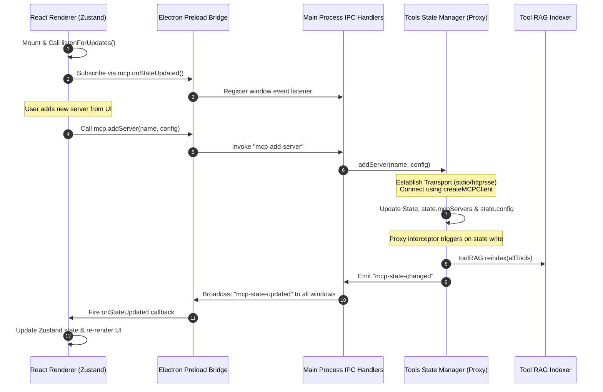

# Model Context Protocol (MCP) Tools & Store Architecture

This document describes the Model Context Protocol (MCP) tool integration and state synchronization architecture implemented in the DOST application. 

The system enables the LLM agent to dynamically discover, index, and run local (Stdio) and remote (HTTP/SSE) tool servers, with strict user-profile data isolation.

---

## 1. Multi-Process Architecture & State Sync

The MCP architecture divides responsibilities across Electron processes to maintain safety, speed, and real-time UI reactive state.



---

## 2. Component Implementation Details

### A. React Renderer Zustand Store
* **File:** `client/src/store/mcpStore.js`
* **Purpose:** Exposes reactive state (`mcpServers`, `toolCount`, `config`, `isMcpConnected`) to React pages and components, and triggers IPC actions.
* **Sync Loop:** On component mount, the store calls `listenForUpdates()` which registers a callback through `window.mcp.onStateUpdated()`. When the Electron main process broadcasts a state change, Zustand updates its store in memory, forcing a reactive re-render of active components.

### B. Preload Bridge
* **File:** `electron/preload.js`
* **Purpose:** Safely exposes IPC channels under `window.mcp` to prevent exposing the full Node.js `ipcRenderer` to the frontend web environment.

### C. Electron Main Process (`Tools` Manager)
* **File:** [electron/mcp/tools.js](file:///d:/Python%20Save%20files/dost-mcp/mcp-desktop-client/electron/mcp/tools.js)
* **Purpose:** Manages server connection instances, configuration files, and state updates.
* **The State Proxy:** State is wrapped in a Javascript `Proxy` which automatically intercepts modifications.
  * **Broacasting:** Any write to `state` checks if the value has changed, and if so, fires the `"mcp-state-changed"` event to the IPC listener, broadcasting the updated state to all UI windows.
  * **Automated RAG Indexing:** Any update to `state.mcpServers` automatically triggers `toolRAG.reindex(this.getTools())` to re-index active tools into the vector search store.

---

## 3. MCP Store & Configuration Schema

The application handles two representations of the MCP configuration and connection states: the internal main-process connection cache, and the serialized, UI-safe Zustand representation.

### A. Internal Main-Process State (`Tools.state`)
The connection objects and raw JSON files are managed in Node.js inside the `Tools` instance state:
```javascript
{
  config: {
    // Map of serverName -> ServerConfig
  },
  mcpServers: {
    [serverName]: {
      client: Object,      // Active experimental_createMCPClient instance
      tools: Object,       // Active tools returned by client.tools()
      metadata: {
        description: String,
        transport: "stdio" | "streamable_http" | "sse",
        url: String | null
      },
      connected: Boolean,
      connectedAt: Date
    }
  },
  isMcpConnected: Boolean
}
```

### B. Serialized UI Zustand State (`mcpStore`)
To prevent exposing complex, active socket/process client handles to the React renderer, `_transformStateForUI()` flattens the connection instances into an API-safe JSON structure before broadcasting:
```javascript
{
  config: {
    // Map of serverName -> ServerConfig
  },
  mcpServers: {
    [serverName]: {
      description: String,
      transport: "stdio" | "streamable_http" | "sse",
      url: String | null,
      tools: [
        {
          name: String,
          description: String
        }
      ],
      toolCount: Number,
      connected: Boolean
    }
  },
  toolCount: Number,       // Sum of all active tools across connected servers
  isMcpConnected: Boolean
}
```

### C. Config File Schema (`mcp.json`)
The configurations are persisted on disk using the following schema:
```json
{
  "server_name": {
    "transport": "stdio",
    "command": "python",
    "args": ["-m", "mcp_server"],
    "enabled": true,
    "description": "Local stdio server"
  },
  "remote_server": {
    "transport": "streamable_http",
    "url": "http://localhost:8000/mcp",
    "headers": {
      "Authorization": "Bearer key_here"
    },
    "enabled": true,
    "description": "Remote HTTP server"
  }
}
```

---

## 4. Configuration & Profile Isolation

To support multiple profiles on the same machine, DOST isolates configuration files using the active user's ID decoded from the JWT session.

* **Path Resolver:** `getMcpConfigPath()` computes the user-specific directory path:
  ```javascript
  path.join(app.getPath("userData"), "users", String(this.activeUserId), "mcp.json")
  ```
* **Directory Switch:** When a user logs in or out, `setActiveUserId(userId)` clears the in-memory configuration and re-routes the file reads/writes to the new profile path, ensuring profile isolation.

---

## 5. Supported Transports & Connection Flow

The `Tools` instance dynamically configures transports according to the configuration schemas:

### Transport Protocol Types
1. **Stdio (`stdio`):** Runs a local command-line subprocess.
   ```javascript
   new StdioClientTransport({
       command: serverConfig.command,
       args: serverConfig.args || [],
   })
   ```
2. **HTTP (`http` or `streamable_http`):** Connects to a streamable HTTP endpoint.
   ```javascript
   new StreamableHTTPClientTransport(new URL(serverConfig.url), {
       requestInit: { headers: serverConfig.headers || {} }
   })
   ```
3. **SSE (`sse`):** Connects to Server-Sent Events (SSE) streaming connections.

### Connection Pipeline (`initializeMcpClients`)
When connection initialization is triggered:
1. Filter all enabled servers from the active user's `mcp.json`.
2. Connect to all enabled servers concurrently using `Promise.allSettled` to prevent single-server failures from halting the application startup.
3. For each successful connection, compile the tool list metadata and flag the server status as `connected: true`.
4. Update the state proxy with the new client connections, triggering the automated RAG indexing and UI state broadcast.
