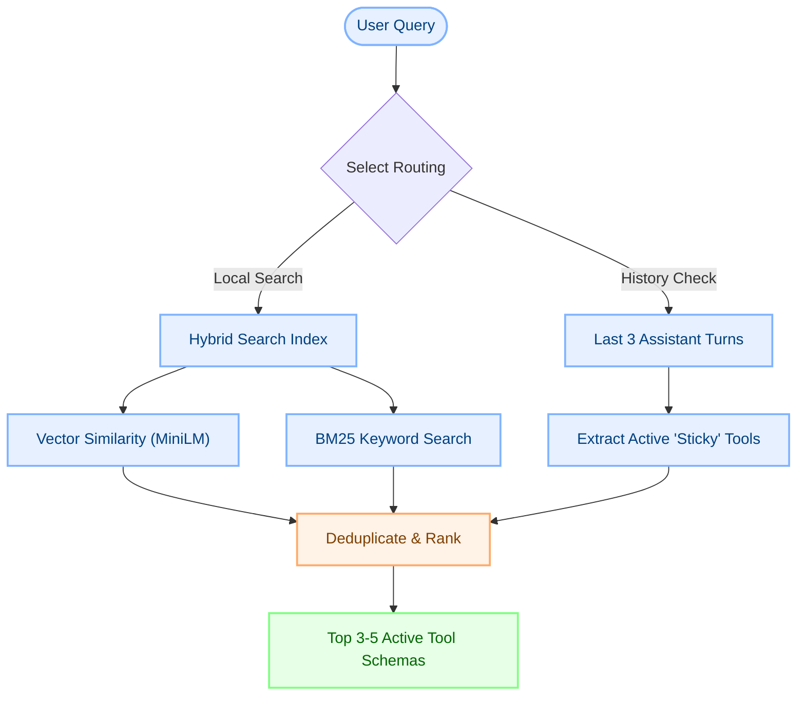

# Solving Tool Inflation with Tool RAG

As agentic environments grow, developers frequently run into the problem of **Tool Inflation** (also known as the "Too Many Tools" problem). While Model Context Protocol (MCP) makes it trivial to connect dozens of local and remote tool servers, exposing every registered tool schema to the LLM on every turn degrades performance and compromises system reliability.

DOST solves this with **Tool RAG**, a localized Retrieval-Augmented Generation pipeline designed specifically for tool schema discovery and selection.

---

## 1. The Cost of Tool Inflation

Exposing too many tool definitions to an agent leads to three major issues:

1. **Attention Dilution ("Lost in the Middle"):** Large Language Models exhibit degraded instruction-following when forced to process long prompts. If 50 tool schemas are defined, the model is more likely to miss constraints, hallucinate arguments, or select the wrong tool.
2. **Context Window Waste:** Tool schemas are structured JSON objects containing descriptions, argument types, and validation constraints. A single complex tool can consume 400+ tokens. Exposing 50 tools wastes ~20,000 tokens per call before any chat history is even included.
3. **Execution Latency:** Larger prompt sizes increase pre-fill time (TTFT) and inference latency, slowing the agent's response speed.

---

## 2. Tool RAG Architecture

DOST executes a three-part retrieval process locally on the desktop client before making any LLM requests.

### A. Local Hybrid Search
The retrieval system combines two distinct algorithms using a client-side `@orama/orama` search index:
- **Vector Semantic Search:** Uses a local, quantized **MiniLM-L6-v2** model (384 dimensions) to match queries by conceptual meaning (e.g. *"how hot is it in London"* matches a `get_weather` tool based on semantic similarity of "hot" and "weather").
- **BM25 Keyword Search:** Handles exact text matching for command fragments, parameters, or tool names (e.g. searching for *"run script"* matches `run_npm_script`).

### B. Vague Query Context Enrichment
Users often write vague follow-up prompts, such as *"do it"* or *"check the second one"*. On their own, these queries fail semantic matching for tool discovery.

Tool RAG automatically detects vague queries (defined as queries under 6 words or with a top search score below `0.4`) and merges them with the **previous user message** to reconstruct the target context:
- **Raw User Input:** *"read it"*
- **Previous Input:** *"locate the config file in client"*
- **Enriched Search Query:** *"locate the config file in client read it"* (which successfully retrieves the `read_file` tool).

### C. Sticky Context Continuity
If an agent is in the middle of a multi-turn task (e.g., editing a file, compiling, reading error, editing again), the tools used in the previous steps must remain available. 

Tool RAG scans the last **3 assistant turns** in the active session and marks any used tools as **"sticky"**. These sticky tools are automatically appended to the active schema list, bypassing search scores to guarantee execution continuity.

---

## 3. Performance Comparison

| Feature | Without Tool RAG | With Tool RAG |
| :--- | :--- | :--- |
| **Model distraction rate** | High (5% - 12% wrong calls) | Extremely Low (< 0.5%) |
| **Token overhead per prompt** | ~20,000 tokens (static) | ~1,200 tokens (dynamic) |
| **Average pre-fill time (TTFT)** | ~2.5 seconds | ~0.15 seconds |
| **Multi-turn stability** | Fragile (Tools drop out) | High (Sticky context protection) |

By dynamically projecting the minimum necessary toolset onto the LLM, DOST achieves production-grade execution accuracy while keeping resource usage highly optimized.
