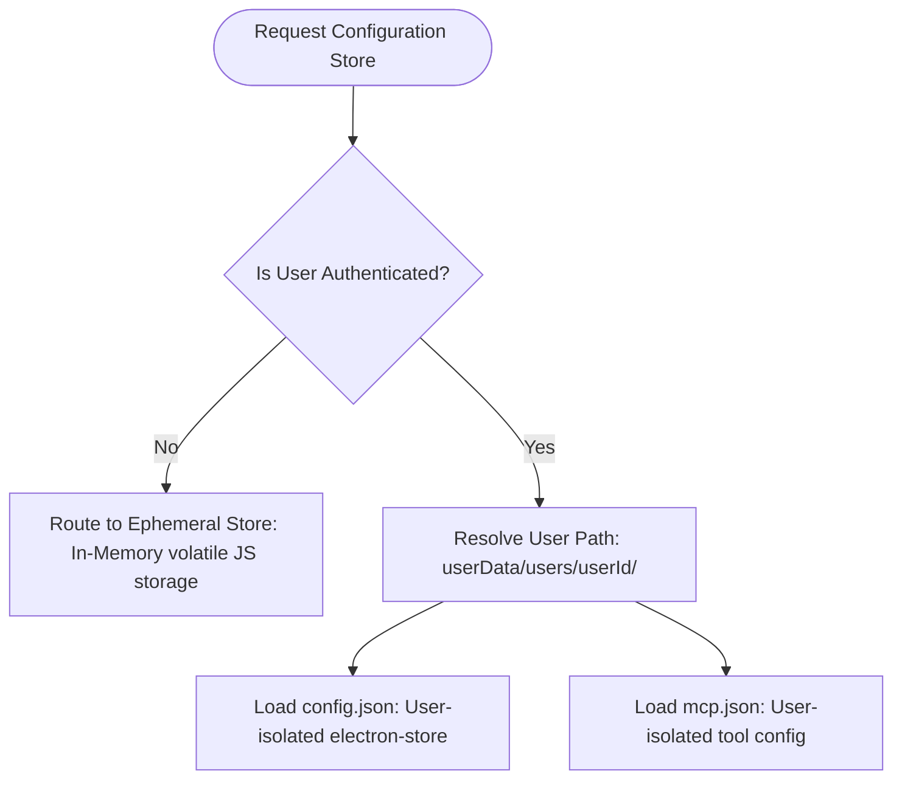
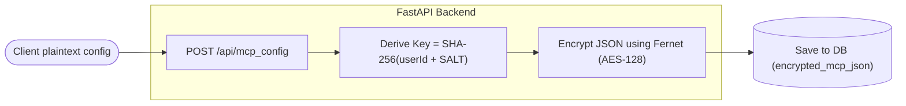

# User Data Isolation & Multi-Profile Architecture

This document describes the design and implementation of the user-isolation and multi-profile security model in DOST. This architecture ensures that multiple user accounts sharing a single machine can do so safely, preventing leakages of API keys, configurations, active tools, or chat histories.

---

## 1. Client-Side Directory Separation (Electron)

The desktop application separates user contexts at the operating system file system level inside the application's root `userData` directory.

### Directory Mapping
Depending on the user's authentication state, data is routed to isolated structures:



### Storage Directory Layout
```text
%APPDATA%/dost-mcp/                     # Application userData root
    profile-meta.json                    # Shared metadata store (saves lastUserId)
    users/
        01KNJ27TGXTZC1NKJE2NRWG2A4/      # Isolated folder for User A (ULID)
            config.json                  # Preferences, model selection, local configurations
            mcp.json                     # Plaintext cache of active tool servers
        01LPA52THXTYC2PKJE3NRWG2B5/      # Isolated folder for User B (ULID)
            config.json
            mcp.json
```

---

## 2. Context Switching & Storage Lifecycle

The application switches configurations reactively when users sign in, refresh tokens, or sign out.

### A. Initialization & Context Setters
When the React UI sets or clears a token, the Electron main process interceptors adjust the global storage scope:
* **`setActiveUser(userId)`:** Saves the `userId` in `profile-meta.json` (as `lastUserId`) to persist the active profile context across application restarts.
* **`getStore()`:** Queries the active user ID and returns the isolated configuration store (`config.json`) mapped to `users/{userId}/`. If the user is unauthenticated, it falls back to a volatile, in-memory `ephemeralStore`.
* **`clearActiveUser()`:** Triggered on logout. Removes the `lastUserId` reference from metadata and wipes active user scopes.

### B. Scoped Store Resolution (`getScopedStore`)
The main process routes keys depending on their scope:
* Keys matching `"globalStore"` are routed to the root `profile-meta.json` (tracks shared options like theme and `logged` state).
* Other keys map to the active user's `config.json`.

---

## 3. Profile Transition & Leakage Prevention

Switching accounts triggers a cascade of state purges and re-initializations across the client and main processes to prevent cross-user leakage:

1. **AI Model Environment Purging (`electron/ai/models.js`):**
   Before applying profile-specific API keys during `init()`, the main process explicitly clears known provider variables from `process.env`. This prevents old API keys from persisting in the application's environment after an account switch.
2. **Chat Query Cache Eviction:**
   On logout/unauthorized failures, the React client clears the TanStack Query cache (`["chats"]` and `["chat", ...]`) and resets the active chat store (wipes active chat ID, messages, and summary metadata). This prevents a user from seeing a previous user's chat history when logging in on the same machine.
3. **Delayed MCP Initialization:**
   MCP initialization is decoupled from the main application startup sequence. It remains idle until a user is authenticated, protecting the system from launching local/remote command executions on startup without a valid context.
4. **Zustand Logged Ownership:**
   `logged` state ownership is placed in the `globalStore` (persisted at root level in `profile-meta.json`) rather than user-specific configurations, ensuring consistent refresh scheduling on boot.

---

## 4. Server-Side Per-User Config Encryption

To protect API tokens and command configurations on the cloud, the backend implements per-user database row encryption. If the backend database is compromised, the configurations remain completely secure.

### Cryptography Pipeline


### Encryption Mechanics
1. **Key Derivation:** The server derives a user-specific 32-byte cryptographic key by combining the `user_id` with a secure, environment-protected `SECRET_SALT`:
   ```python
   def get_user_key(user_id: str) -> bytes:
       sha = hashlib.sha256(user_id.encode() + SECRET_SALT).digest()
       return base64.urlsafe_b64encode(sha)
   ```
2. **Encryption:** When a user updates their tool configuration (`POST /mcp_config`), the plaintext JSON string is encrypted via `Fernet` (AES-128 in CBC mode, with HMAC-SHA256 for integrity verification):
   ```python
   def encrypt_mcp_json(mcp_dict: dict, user_id: str) -> str:
       f = Fernet(get_user_key(user_id))
       return f.encrypt(json.dumps(mcp_dict).encode()).decode()
   ```
3. **Decryption:** When the client requests their configuration (`GET /mcp_config`), the backend fetches the `encrypted_mcp_json` string, decrypts it using the user-derived key, and returns the plaintext config payload back to the client.
